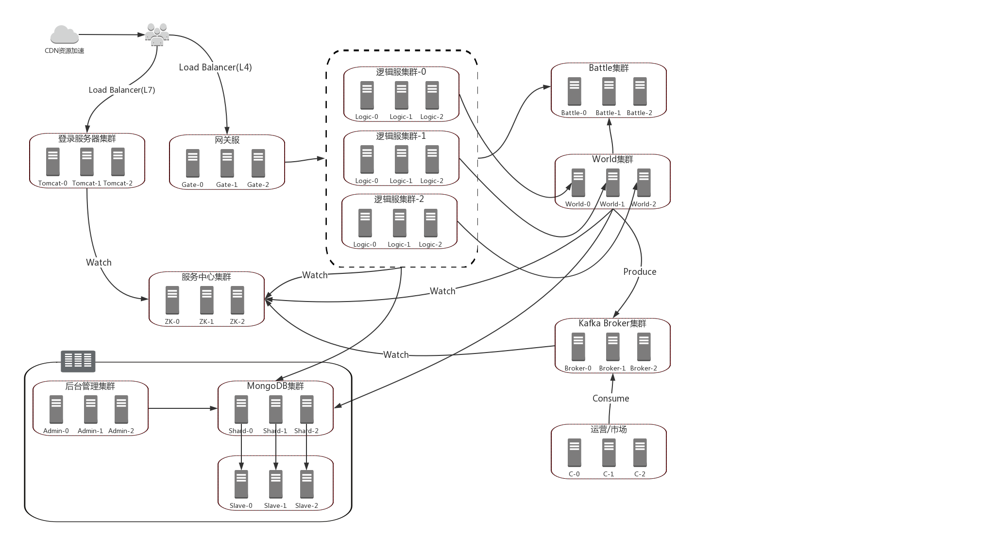
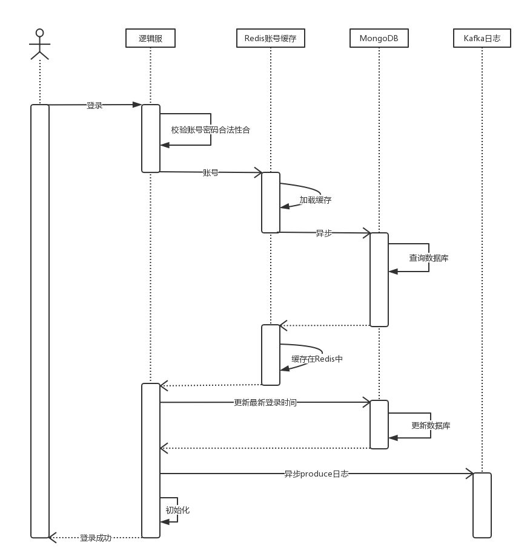

# zfoo
Benefit the world!

##服务器架构图

##UML
1.类图待续 

 
2.用例图待续

3.时序图待续

####尊重商业版权，注明使用工具，uml的在线作图网站：
https://www.processon.com

####kaptcha
一个非常实用的验证码生成工具。有了它，你可以生成各种样式的验证码，因为它是可配置的。  
kaptcha工作的原理是调用 com.google.code.kaptcha.servlet.KaptchaServlet，生成一个图片。同时将生成的验证码字符串放到 HttpSession中。  

####Elasticsearch
ElasticSearch是一个基于Lucene的搜索服务器。它提供了一个分布式多用户能力的全文搜索引擎，基于RESTful web接口。  
Elasticsearch是用Java开发的，并作为Apache许可条款下的开放源码发布，是当前流行的企业级搜索引擎。  
设计用于云计算中，能够达到实时搜索，稳定，可靠，快速，安装使用方便。
