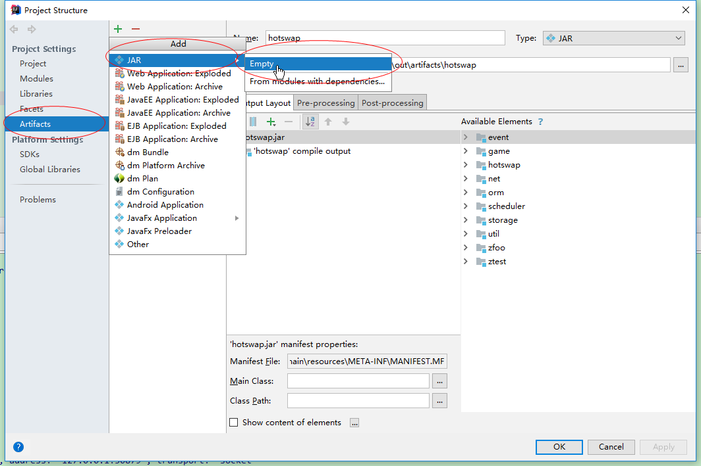
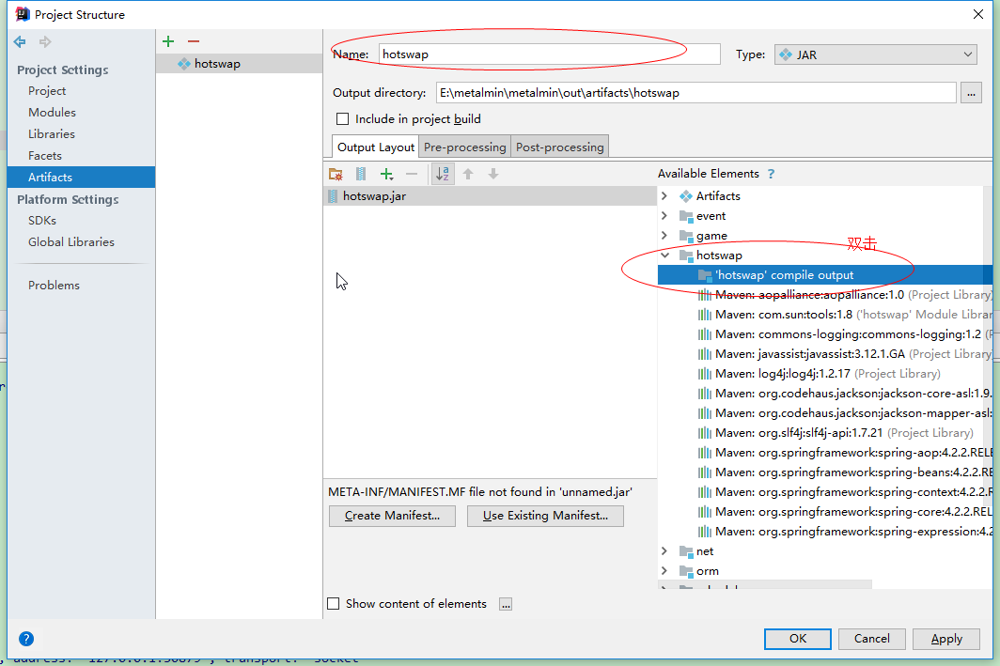
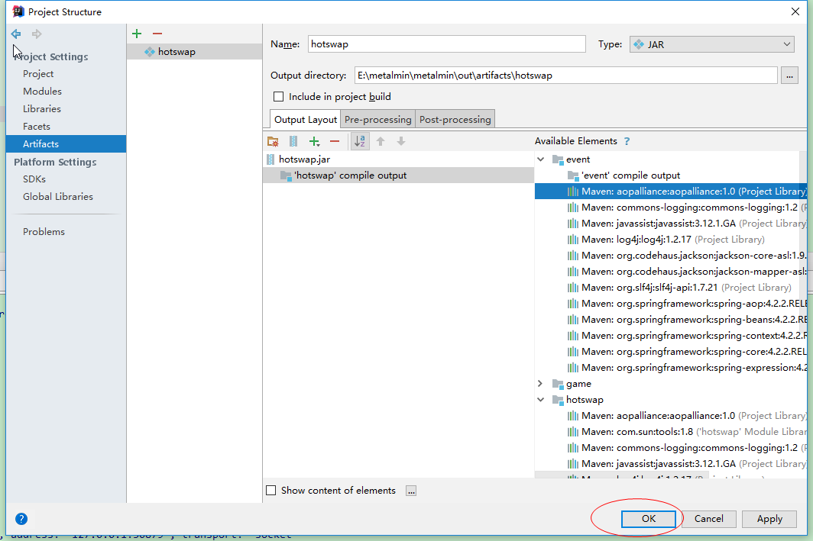
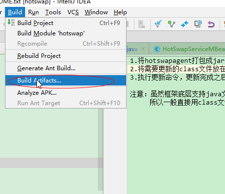
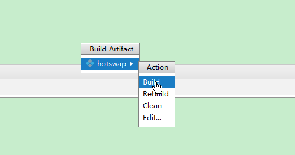
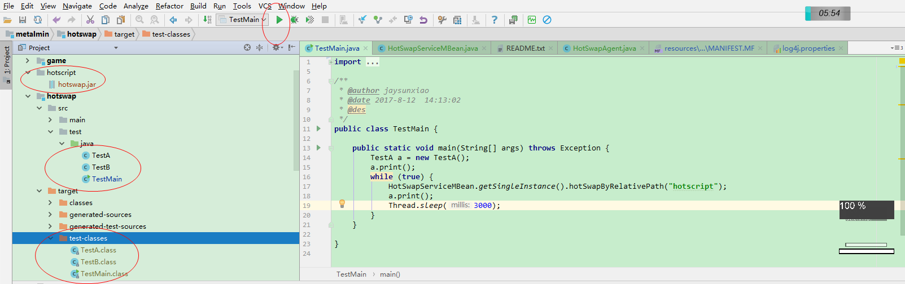
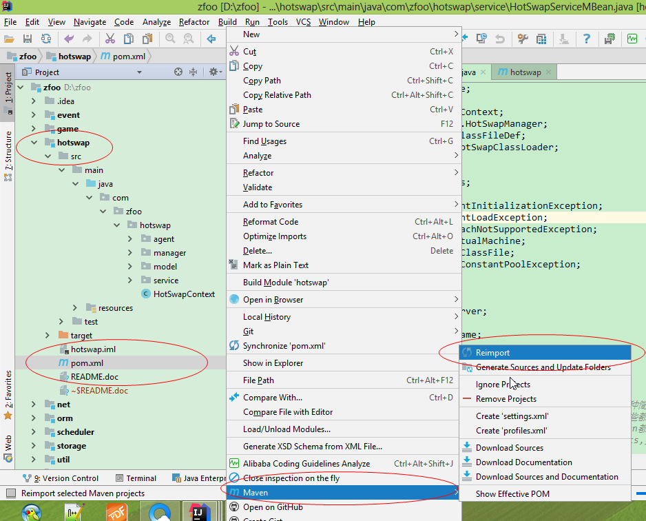

1. 只能直接运行run，不能以调试debug运行，因为如果以debug模式运行的话，idea会自动热更新java源代码；
2. 将hotswapagent打包成jar，放在hotscript中；
3. recompile需要更新的java源文件，生成class字节码；
4. 将需要更新的class文件放在hotscript文件夹中更新；
5. 执行更新命令，更新完成之后自动删除文件；
6. 必须在项目hotswap的目录右键pom项目reimport才能导入sun的工具包。

注意：虽然框架底层支持java文件的热更新，但是这种方式配置繁琐，对命令行javac要有很深入的了解，不太方便。
     所以一般直接用class文件热更新，这样更简单方便一点
