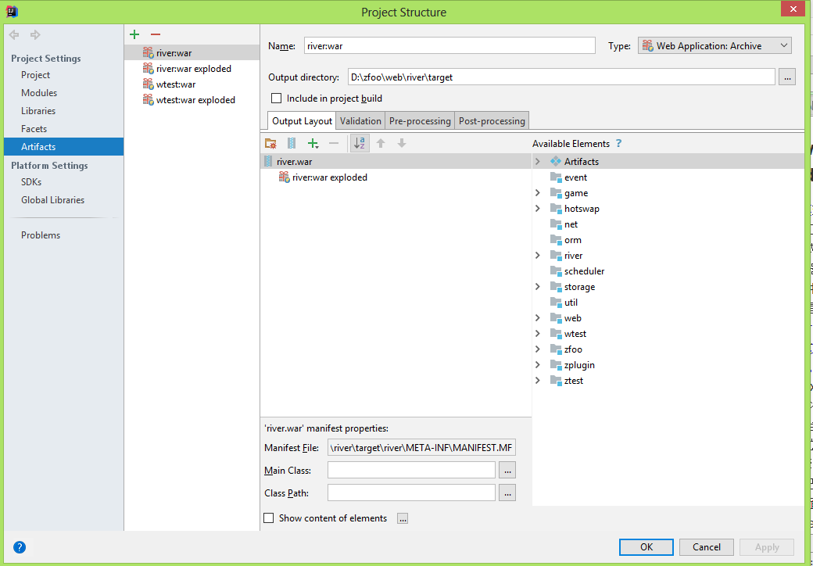
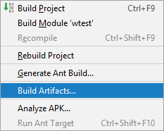
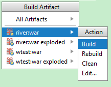

###war和war exploded
- war模式：将WEB工程以包的形式上传到服务器，war模式这种可以称之为是发布模式，看名字也知道，这是先打成war包，再发布；
- war exploded模式：将WEB工程以当前文件夹的位置关系上传到服务器，直接把文件夹、jsp页面 、classes等等移到Tomcat 部署文件夹里面，进行加载部署。因此这种方式支持热部署，一般在开发的时候也是用这种方式。
- 在平时开发的时候，使用热部署的话，应该对Tomcat进行相应的设置，这样的话修改的jsp界面什么的东西才可以及时的显示出来。

###打包war的方式
- 按如下图方式配置idea的structure

- 点击下图的按钮打包war




###war包在Tomcat部署的方式
- 将war包复制到tomcat/webapps下
- 修改tomcat/conf/server.xml文件：
```
<Host name="localhost"  appBase="webapps" unpackWARs="true" autoDeploy="true">
    <Valve className="org.apache.catalina.valves.AccessLogValve" directory="logs" prefix="localhost_access_log" suffix=".txt"
        pattern="%h %l %u %t &quot;%r&quot; %s %b" />		   
    <Context docBase="river" path="/" debug="0"  reloadable="true"/>
</Host>

name：访问的域名，如localhost:8080
appBase：指定虚拟主机的目录,可以指定绝对目录；默认为tomcat/webapps目录
autoDeploy：如果此项设为true,表示Tomcat服务处于运行状态时,能够监测appBase下的文件,如果有新有web应用加入进来,会自运发布这个WEB应用
unpackWARs:如果此项设置为true,表示把WEB应用的WAR文件先展开为开放目录结构后再运行.如果设为false将直接运行为WAR文件

docBase：该Context的根目录是webapps/river/
path：该Context的路径名是"/"，故该Context是该Host的默认Context，即访问localhost:8080/就是访问river
reloadable：如果这个属性设为true, Tomcat服务器在运行状态下会监视在WEB-INF/classes和Web-INF/lib目录CLASS文件的改运.
    如果监视到有class文件 被更新,服务器自重新加载Web应用
```
