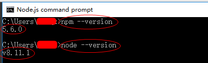

####开发环境：
1.Intellij IDEA  
2.Git  
3.Node.js客户端  
4.Google浏览器

####具体安装方法：
1.安装idea：一路默认直接安装。  

2.安装git： 一路默认安装  
win+R，cmd进入控制台，查看git是否安装成功：git --version 
https://blog.csdn.net/xst686/article/details/46593923/
出现 Bower : ENOGIT git is not installed or not in the PATH错误，则需要配置你的Git到path，具体如下

方法一：假如你的git安装目录是”C:\Program Files (x86)\Git”，在path中( 系统属性中)加入git的bin和cmd目录，如C:\Program Files (x86)\Git\bin;C:\Program Files (x86)\Git\cmd
备注： 如果方法一不起作用是因为，你修改的path没有生效， 你需要重新启动电脑  

3.安装node.js  
因为node.js包含npm，所以只需要安装node.js即可。  
打开刚才安装的nodejs的控制台，那个绿的是交互式nodejs控制台我们不需要，打开下面那个黑色的控制台。  
查看npm是否安装成功：npm --version；  
查看nodejs是否安装成功：node --version；  
  

在Idea中集成nodejs开发环境，在plugins中安装nodejs插件。在pakage.json右键Run npm install即可安装对应的包。  
在Idea中集成vue语法识别功能，在plugins中安装vue插件。  
  
