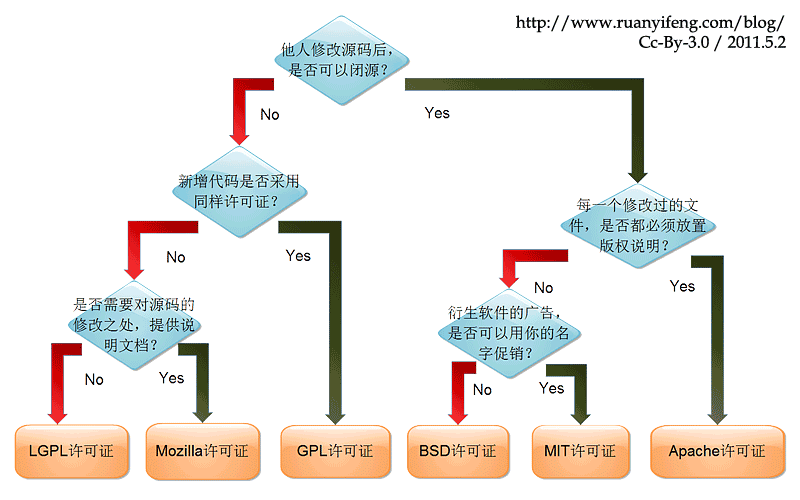

#查询系统状态相关指令：
uname -a             //显示所有系统相关的信息   
localectl        //系统语系
dmidecode -t 1  #秀出整个系统的硬件信息，例如主板型号等等
lspci          #查阅您系统内的 PCI 总线相关设备
iostat         #显示一下目前整个系统的 CPU 与储存设备的状态
iostat -d 2 3 sda #仅针对sda，每两秒钟侦测一次，并且共侦测三次储存设备

netstat -a     #网络状态
netstat -tlnp  #找出目前系统上已在监听的网络联机及其PID，tcp，listening，numeric，program
ntsysv       #类图形接口，管理启动的服务

#账号管理相关指令：
startx        #打开图形窗口
exit          #注销
ls -al ~       #列出/home/jaysunxiao目录下的所有文件，-l，包括文件夹下的文件夹和文件
info date     #查看date使用方法
man date     #查看date使用方法（推荐）
man -f date    #查看date的使用方法文档的位置
which ifconfig  #寻找可执行命令的位置
type ifconfig   #type更强大，可以取代which

date         #软件时钟：Linux自己的系统时间，由 1970/01/01 开始记录的时间参数
hwclock      #硬件时钟：计算机系统在 BIOS 记录的实际时间，这也是硬件所记录的
hwclock -w    #将软件时钟写入 BIOS
ntpdate time.servers.ip && hwclock -w  #Linux 进行网络校时：最简单的方法即是使用
timedatectl    #查看时区
timedatectl set-timezone "Asia/Taipei"    #设置时区
timedatectl set-time "2018-01-22 11:29"  #设置时间,同事设置软件时钟和硬件时钟

id           #查询某人或自己的相关UID/GID信息
who         #观察系统使用的状态
whoami      #显示目前的身份 

passwd        #修改自己的密码

groups       #显示所有的群组

#创建一个账号的流程
useradd -r sun  #建立一个账号sun
passwd sun     #修改sun的密码
cp -a /etc/skel /home/sun     #skeletal骨骼的，此文件是一个用户创建的时候一个模板
chown -R sun:sun /home/sun  #文件夹下全部的归属都改变为sun
chmod 700 /home/sun       #仅要修改目录的权限而非内部文件的权限
userdel -r sun   #删除一个账号，连同家目录一起删除

#创建一个group
groupadd groupsun
groupdel groupsun
#为sun添加群组
useradd -G groupsun -s -m sun

passwd -S sun  #列出密码相关参数，即shadow档案内的大部分信息
passwd -l sun  #将sun的密码锁定
passwd -u sun  #将sun的密码解除锁定
change -l sun   #列出sun的详细密码参数

#开关机相关指令：
sync          #将数据同步写入硬盘中，只不过一般账号用户所更新的硬盘数据就仅有自己的数据，不像root可以更新整个系统中的数据了
shutdown      #关机，只有 root 有权力
shutdown -h now    #立刻关机，等同于halt和poweroff
shutdown -h 20:25  #系统在今天的20:25分会关机，若在21:25下达此指令，则隔天才关机
shutdown -h +10    #系统再过十分钟后自动关机
shutdown -r now    #等于reboot
shutdown -r +30 'The system will reboot'   #再过三十分钟系统会重新启动，显示后面的讯息给所有在在线的使用者
#文件操作相关指令：
pwd                  #显示当前目录print working directory
mkdir -p test1/test2/test3 #如果没有test2，则创建。没有-p选项则不创建
mkdir -m 711 test2      #建立权限为rwx--x--x的目录
rmdir -p test1/test2/test3 #全部删除
cp  ~/.bashrc  /tmp/bashrc    #将家目录下的 .bashrc复制到/tmp下，并更名为bashrc
cp  -i  ~/.bashrc  /tmp/bashrc  #-i ：若目标文件已经存在时，会先询问是否进行(常用)
cp  -a ~/.bashrc  /tmp/bashrc  #-a将文件的所有特性都一起复制过来
rm  -i  bashrc*        #将/tmp底下开头为bashrcde的文件和目录通通删除
rm  -R  /tmp/etc       # 将/tmp/etc/这个目录删除掉，如果不加-r删除不掉
mv mvtest mvtest2      #将目录名称mvtest更名为mvtest2	

rename testfile newfile testfile    #将testfile文件重命名为newfile
cd /tmp               #change directory，所有人都可以工作的/tmp目录中建立文件
mkdir testdir           #建立新目录
chmod 744 testdir       #变更权限r:4，w:2，x:1
touch testdir/testfile     #建立空的文件
chmod 600 testdir/testfile
su - jaysunxiao          #switch user
chown jaysunxiao testdir  #改变档案拥有者，-R递归，文件夹下全部的归属都改变
chgrp                  #改变档案所属群组

cat testfile   #concatenate  [kɒn'kætɪneɪt]，使连续，显示文件内容
cat -n testfile  #显示文件内容，包括行号
tac testfile   #从最后一行开始显示，可以看出tac是cat倒着写
nl testfile    #类似cat -n testfile
more testfile  #一页一页的显示文件内容，space向下翻页
less         #和more类似，但是比more更好的是可以往前翻页，pagedown，pageup
            #/ ：向下搜寻字符串的功能；? ：向上搜寻字符串的功能；
head -n 20 testfile  #显示文件的头几行，默认显示10行
tail -n 20 testfile    #显示末尾几行
od testfile    #以二进制的方式读取文件内容
od -t x testfile  # d：十进制；f ：浮点float；o ：八进制；x：十六进制
umask 002    #umask的分数是默认值需要减掉的权限，文件：666，文件夹：777
chattr +a testfile   #-a:文件将只能增加数据，不能删除也不能修改数据，root才能设定
                 #-i:让文件不能被删除、改名、无法写入或新增资料！』root才能设定
lsattr testfile   #显示文件的隐藏属性
file testfile   #观察文件的类型
whereis testfile
locate testfile  #会从数据库中查找，所以速度比较快
updatedb   #updatedb指令会去读取 /etc/updatedb.conf的配置去更新，
#每天更新数据一次，也可以手动更新
find / -mtime 0             #0代表目前的时间
find /etc -newer /etc/passwd  #-newer file ：列出比 file 还要新的文件名
find /home -user jaysunxiao   #搜寻/home底下属于jaysunxiao的文件
find / -nouser               #搜寻系统中不属亍任何人的文件
find / -name testfile          #搜寻某个文件名，'*httpd*'可以使用通配符
find / -size +1000k           #找出系统中，大于1MB的文件
find . -type f | xargs -n 10 grep "dir"   #当前文件夹下，包含dir关键字的文档，每次取10个
find . -type f | xargs -n 10 grep -l "dir"  #只取出文件的名称
ln /tmp/testdir    #hard link链接
ln -s /tmp/testdir  #建立一个符号链接，类似windows下的快捷方式类似
gzip -v file   #压缩file文件
gzip -d file.gz  #解压缩file的压缩文件file.gz
tar -jpcv -f dir.tar.bz2 dir > /tmp/log.txt 2>&1  #将dir文件夹压缩名为dir.tar.bz2的压缩文件
             #2>&1，指将标准输出、标准错误指定为同一输出路径
tar -jxv -f dir.tar.bz2 -C /tmp/testdir/dir  #将压缩文件dir.tar.bz2解压到/tmp/testdir/dir
test -e testfile && echo "exist" || echo "Not exist"  #存在，-f文件，-d文件夹，-e两者之和

vim /etc/vimrc  #vim的配置文件
vim testfile   #用vim打开testfile
:set nu     #在vim中打开行号
:u         #回复到原始状态
:q!        #不存储直接离开
:sp testfile  #在新窗口中打开testfile文件，同时打开两个窗口
#G第一行，gg最后一行，yy复制当前行，p粘贴，dd删除当前行
#删除全部：Gdgg
#ctrl+v选择，y复制，p粘贴，通用的规则
unix2dos -k testfile  #转换为dos换行格式
dos2unix -k testfile  #转换为unix的换行格式
env         #查看系统所有变量 set还会把自定义的变量打印出来
read -p "Please keyin your name: " -t 30 named  #30秒内输入名字，输入作为named变量
stty -a      #列出所有的按键与按键的内容
echo $PATH    #PATH路径，这个是用来指定执行文件执行的时候，指令搜寻的目录路径
echo $RANDOM  #获取随机数，每次都不一样
echo $SHELL   #当前使用的shell位置
echo $$       #shell使用的线程号
echo $?       #shell的回传值
alias        #命令别名
history      #历史输入命令的记录，echo $HISTSIZE
history -w    #立刻将目前的资料写入~/.bash_history当中
history  >>  testfile  #>, >> 数据流重导向：输出，分别是覆盖和追加
find /home -name .bashrc > list_right 2> list_error  #<, << 数据流重导向：输入
                   #将stdout和stderr存到不同的文件中去
ls -al /etc | less  #管线命令能处理stdout，但是不能处理stderr
last | grep "root"   #last登录记录，取出包含root的那几行
last | grep -n "root"  #加上行号
last | grep -v "root"  #只要没有root就取出
last | sort   #

sh -n scriptfile  #不要执行script，仅查询语法的问题
sh -v scriptfile  #再执行sccript前，先将scripts的内容输出到屏幕上；
sh -x scriptfile  #将使用到的script语句内容显示到屏幕上，这是很有用的参数！

run level 0   #关机
run level 3   #纯文本模式
run level 5   #图形接口模式
run level 6   #重新启劢
init 0        #关机
ulimit -a     #出你目前身份(假设为root)的所有限制资料数值
ulimit -f 10240 #限制用户仅能建立10MBytes以下的容量的文件

#定时任务相关指令：
/etc/init.d/atd restart  #启动atd服务
systemctl enable atd      #设置成开机启动
at now + 5 minutes   #启动一个任务5分钟后执行，ctrl+d结束
atq           #查询目前主机上面有多少个at工作排程，下达指令必须用绝对路径
atrm 5        #移除第五个at任务

crontab -e     #编辑cron任务，0 12 * * * mail root -s "at 12:00"，每天12点提醒
             #分钟，小时，日期，月份，周。不同于java中更细致的划分，注意
crontab -l     #查看系统所使用的全部cron表达式
crontab -r     #移除全部的cron表达式任务，
#很多时候被植入木马都是以例行命令的方植入，
#所以可以藉由检查/var/log/cron的内容来视察是否有其它非法cron执行了
mail jaysunxiao -s "nice to meet you"  #以  .  结束
mail         #使用mail查看邮件，？为使用帮助
write jaysunxiao  #给jaysunxiao发送信息
wall "I will shutdown my linux server..."  #给全部的使用者发送信息

#程序和服务相关指令：
jobs -l        #查看目前后台工作的程序
fg %1        #取出第一个后台运行的程序
bg %2        #让第二个后台程序运行
kill -9 %3     #强制删除一个第3个不正常的工作，jobs里的程序
kill -15 %2    #以正常的程序方式终止一个程序。和-9 是不一样的
killall -9 httpd  #强制终止所有以httpd启动的程序，killall -i -9 bash，每次询问

kill -9 4597  killall -9 cupsd   #完全终止一个程序PID，包括执行它的程序
ps -l         #属于你自己这次登入的PID相关信息列示出来(只与自己的bash有关)
ps aux       #列出目前所有的正在内存当中的程序
ps axjf      #列出类似程序树的程序显示
pstree -Aup   #列出目前系统上面所有的程序树，同时秀出PID与users
top -d 2      #每两秒钟更新一次top，观察整体信息，默认为5秒
top -d 2 -p $$  #$$当前程序的pid，观察当前程序
             # 输入r然后输入这个PID号，改变NI的值，让其优先执行
             #P：以CPU的使用资源排序显示；M：以Memory的使用资源排序显示；
            #T：由该Process使用的CPU时间累积(TIME+)排序。
free -m      #显示目前系统的内存容量，单位KB
vmstat -d    #系统上面所有的磁盘的读写状态
fuser -mvu /proc  #找到所有使用到/proc这个文件系统的程序吧
lsof -u root | grep bash  #属于root 的bash这支程序所开启的文件	
pidof bash    #列出目前系统上面bash的pid
  

yum install package_name
rpm -ivh package_name  #yum更强大不仅支持线上还支持线下
rpm -q logrotate    #RedHat Package Manager，是否有安装logrotate这个软件
rpm -ql logrotate   #属于该软件所提供的所有目录与文件
rpm -qi logrotate    #列出logrotate这个软件的相关说明数据
#-qa：列出所有的已经安装软件名称，后面加名称表示安装依赖
#-qc：列出该软件的所有配置文件（找出在/etc/下面的文件名而已）
#-qd：列出该软件的所有说明文档（找出与man有关的文件而已）
#-qR：列出与该软件有关的相依软件所含的文件（Required的意思）
#-qf：由后面接的文件名称，找出该文件属于哪一个已安装的软件；
rpm -Va        #列出目前系统上面所有可能被更动过的文件
rpm -V logrotate #列出你的Linux内的logrotate 这个软件是否被更动过
rpm -e logrotate  #移除logrotate
rpm --rebuilddb  #重建数据库RPM数据库

yum info mdadm  #找出mdadm这个软件的功能为何
yum repolist all   	#yellowdog updater modified，列出yum服务器上面提供的所有软件名称
yum clean all     #删除已下载过的所有容器的相关数据 (含软件本身与列表)
yum list updates  #列出目前服务器上可供本机进行升级的软件有哪些
yum install madam     #安装madam
yum remove madam   #移除madam
yum grouplist    #目前软件库与本机上面的可用与安装过的软件群组有哪些
yum groupinfo "Scientific Support"
yum -y update    #全系统更新

cat /etc/services | grep "www"  #/etc/services记录了所有服务端口，查看www服务的端口
systemctl list-unit-files --type=service  #查看所有服务
systemctl status atd.service       #查看atd这个服务的状态
systemctl stop atd.service    #停止这个服务，但是下次开机还会重启
systemctl disable atd.service  #设置开机不是自动重启 
systemctl start atd.service    #启动atd服务
systemctl restart atd.service  #重新启动

#安装软件的步骤：
yum install httpd
systemctl daemon-reload
systemctl start httpd    #启动
systemctl enable httpd  #开机启动
systemctl status httpd
firewall-cmd --add-service="http"  #防火墙
firewall-cmd --permanent --add-service="http"
firewall-cmd --list-all

tab           #接在一串指令的第一个字的后面，则为命令补全
ctrl+c        #cancel
ctrl+d        #exit
ctrl+z         #暂停程序

/usr/share/doc  #说明文件保存的位置

对文件来说，权限的效能为：
r：可读取此一档案的实际内容，如读取文本文件的文字内容等；
w：可以编辑、新增戒者是修改该文件的内容(但不能删除该文件)；
x：该档案具有可以被系统执行的权限。
对目录来说，权限的效能为：
r：(read contents in directory)
w：(modify contents of directory)
x：(access directory)
要开放目录给任何人浏览时，应该至少也要给予r及x的权限，但w权限不可随便给

  / (root, 根目录)：与开机系统有关；
  /usr (unix software resource)：与软件安装/执行有关；
  /var (variable)：与系统运作过程有关。

因此FHS标准建议：根目录(/)所在分割槽应该越小越好，且应用程序所安装的软件最好不要与根目录放在同一个分割槽内，保持根目录越小越好。 如此不但效能较佳，根目录所在的文件系统也较不容易发生问题。
开机过程中仅有根目录会被挂载，其他分割槽则是在开机完成之后才会持续的进行挂载的行为。就是因为如此，因此根目录下与开机过程有关的目录，就不能够与根目录放到不同的分割槽去！那哪些目录不可与根目录分开呢？有底下这些： 
/etc：配置文件，使用者合法shells，passwd，登入提示issue，vim配置文件vimrc
/bin：重要执行档
/dev：所需要的装置档案
/lib：执行档所需的函式库与核心所需的模块
/sbin：重要的系统执行文件

新增一颗硬盘时，需要做的工作：
1. 对磁盘迚行分割，以建立可用的partition ；
2. 对该partition进行格式化( format )，以建立系统可用的filesystem；
3. 若想要仔细一点，则可对刚刚建立好的filesystem进行检验；
4. 在Linux系统上，需要建立挂载点(亦即是目录)，并将他挂载上来；
fsck /dev/sda7     #检查磁盘
df            #查看filesystem discription
df -h          #将容量结果以易读的容量格式显示出来
fdisk -l        #列出所有的partition
fdisk /dev/sdb  #不要加上数字，是针对整个U盘的操作，d删除分区，n新增分区，w保存
partprobe     #让核心更新partition table
mkfs -t vfat /dev/sdb1  #make filesystem 格式化分区，创建一个filesystem
fsck /dev/sdb1  #检查和修正文件系统错误的指令
mount /dev/sdb1 /mnt/sdb1  #将前者挂在到后者
mount -l       #观察目前已挂载的文件系统
umount /mnt/sdb1    #卸除挂载点

挂载点选择：
1. 单一文件系统不应该被重复挂载在不同的挂载点(目录)中；
2. 单一目录不应该重复挂载多个文件系统；
3. 要作为挂载点的目录，理论上应该都是空目录才是。
Ext2文件系统主要有：boot sector, superblock, inode bitmap, block bitmap, inode table,
data block

正则表达式：
t[ae]st，包含tast或test的单词；
[^g]oo，不包含goo的；
[^a-z]oo，不是以小写字母+oo的；
^[a-z]，行开头是小写字母的；
\.$，行末尾以点结束的
^$，空白行的；
g..d，g??d 的字符串；
ooo*，至少两个o以上的字符串，从0开始，*是重复0到无穷多个的前一个字符
g.*g，以g开头以g结尾的；
go\{2,5\}g，g 后面接 2 到 5 个 o；

grep -v "^#" file| grep -v "^$" | grep "^[a-zA-Z]" | wc -   #去除开头#的行，去除空白行
#去除开头为英文字母的那几行， 统计总行数

#网络相关指令：
route -n      #查看路由信息
route add -net 192.168.5.0 \
> netmask 255.255.255.0 dev eth0    #增加一个路由，必须网卡能够联系的到
arp -n        #列出目前主机上面记载的 IP/MAC 对应的 ARP 表格
dmesg | grep -in eth       #观察核心所捉到的网卡信息
ifconfig                  #查看ip相关信息
ifconfig wlp3s0           #查看wlp3s0这个网卡的相关信息
ifconfig wlp3s0:0 192.168.25.141  #那就是在该实体网卡上，再仿真一个网络接口
ifconfig wlp3s0:0 192.168.25.141 netmask 255.255.255.0 up
ifconfig eth0:0 down        #关掉 eth0:0 这个界面
/etc/init.d/network restart   #将手动的处理全部取消，使用原有的设定值重建网络参数

curl icanhazip.com      #查看public ip

netstat -a     #网络状态
netstat -tlnp  #找出目前系统上已在监听的网络联机及其PID，tcp，listening，numeric，program
netstat -tulnp  #tcp,udp都显示出来

nmap localhost               #使用预设参数扫瞄本机所启用的 port (只会扫瞄 TCP)
nmap -sTU localhost           #同时扫瞄本机的 TCP/UDP 端口
nmap nmap -sP 192.168.1.0/24  #透过 ICMP 封包的检测，分析区网内有几部主机是启动的
nmap 192.168.1.0/24          #将各个主机的启动的 port 作一番侦测

traceroute -n www.baidu.com #UDP:侦测本机到baidu去的各节点联机状态
traceroute -w 1 -n -T www.baidu.com #TCP

 
#DNS相关设定
/etc/resolv.conf      #DNS 服务器地址查询
dig www.baidu.com  #查看DNS服务器配置是否成功
dig -x 120.114.100.20 #查询 120.114.100.20 的反解信息结果
whois baidu.com    #查询领域管理者相关信息
vim /etc/hosts      #增加ip对应的地址，如localhost

#SELinux
ls -Z       #观察安全性文本
getenforce  #查看SELinux是否开启，建议关闭，
#enforcing：强制模式，代表 SELinux 运作中；disabled：关闭
vim /etc/selinux/config   #设置SELinux的开启和关闭，必须要重新启动

#iptables防火墙相关操作
iptables -t filter -L -n
iptables -t nat -L -n

#设定 lo 成为受信任的装置，亦即进出 lo 的封包都予以接受
iptables -A INPUT -i lo -j ACCEPT
iptables -A INPUT -i eth1 -j ACCEPT  #针对eth1网卡

filter (过滤器)：主要跟进入 Linux 本机的封包有关，这个是预设的table 喔！
o  INPUT：为来自外部，想要进入主机的封包；
o  OUTPUT：为来自主机，想要离开主机的封包；
o  FORWARD：为主机内部网域与外部网域的封包(不论进或者出)，但该封包不会进入主机。

nat (地址转换)：Network Address Translation， 这个表格主要在进行来源与目的之 IP 或 port 的转换，与 Linux 本机较无关，主要与Linux 主机后的局域网络内计算机较有相关。
o  PREROUTING：进行路由之前的封包传送过程
o  POSTROUTING：已经经过路由了，然后才进行的过滤规则。(SNAT/MASQUERADE)
o  OUTPUT：离开主机的封包传送过程；

Secure SHell protocol  SSH安全的壳程序协议=shell + ftp  

###########################################################################

  IP:设定为 192.168.100.1~192.168.100.253 ，但 IP 不可重复；
  Netmask：255.255.255.0
  Network：192.168.100.0、Broadcast：192.168.100.255
  Default Gateway：192.168.100.254 (路由器的 IP)
  DNS：暂时使用 168.95.1.1

IP 的分级：

Class A :
 0xxxxxxx.xxxxxxxx.xxxxxxxx.xxxxxxxx ==> NetI_D 的开头是 0
|--net--|---------host------------|

Class B :
 10xxxxxx.xxxxxxxx.xxxxxxxx.xxxxxxxx ==> NetI_D 的开头是 10
|------net-------|------host------|

Class C : 
110xxxxx.xxxxxxxx.xxxxxxxx.xxxxxxxx ==> NetI_D 的开头是

Class D : 
1110xxxx.xxxxxxxx.xxxxxxxx.xxxxxxxx ==> NetI_D 的开头是

Class E : 
1111xxxx.xxxxxxxx.xxxxxxxx.xxxxxxxx ==> NetI_D 的开头是

Class A : 0.xx.xx.xx ~ 127.xx.xx.xx
Class B : 128.xx.xx.xx ~ 191.xx.xx.xx
Class C : 192.xx.xx.xx ~ 223.xx.xx.xx
Class D : 224.xx.xx.xx ~ 239.xx.xx.xx
Class E : 240.xx.xx.xx ~ 255.xx.xx.xx

Class D 是用来作为群播(multicast) 的特殊功能之用 (最常用在大批计算机的网络还原)
Class E 则是保留没有使用的网段
能够用来设定在一般系统上面的，就只有 Class A, B, C三种等级的 IP

Public IP : 公共IP，经由INTERNIC所统一规划的IP，有这种IP才可以连上 Internet

Private IP : 不能直接连上 Internet 的IP，主要用于局域网络内的主机联机规划:
Class A：10.0.0.0 - 10.255.255.255
Class B：172.16.0.0 - 172.31.255.255
Class C：192.168.0.0 - 192.168.255.255

loopback IP 网段：127.0.0.1
没有安装网络卡在的机器上面， 但是你又希望可以测试一下在你的机器上面设定的服务器环境到底可不可以顺利运作

Netmask: 255.255.255.0 <==网域定义中，最重要的参数
Network: 192.168.0.0 <==指定第一个 IP，就可以计算出下面的数值
Broadcast: 192.168.0.255 <==最后一个 IP
可用以设定成为主机的 IP 数：
192.168.0.1 ~ 192.168.0.254

npm install --save vue
npm install --save-dev vue-loader
npm install --save-dev vue-style-loader
npm install --save-dev vue-template-compiler
npm install --save-dev vue-hot-reload-api
npm install --save-dev babel
npm install --save-dev babel-loader
npm install --save-dev babel-core
npm install --save-dev babel-plugin-transform-runtime
npm install --save-dev babel-preset-es2015
npm install --save-dev babel-runtime
