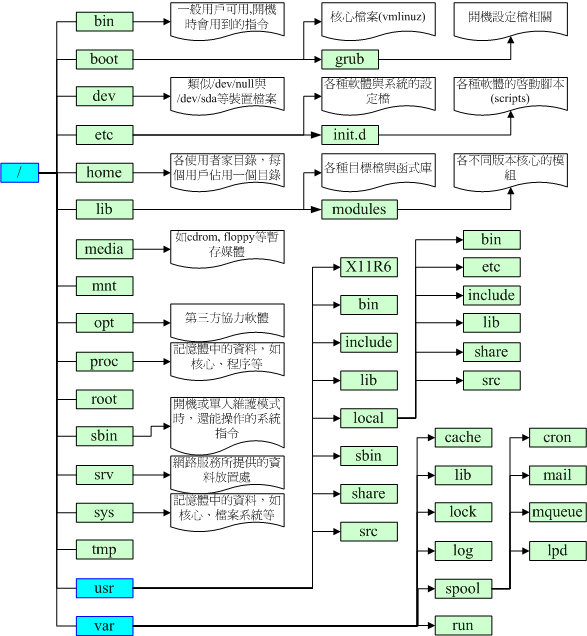

```
/ (root, 根目录)：与开机系统有关；
/usr (unix software resource)：与软件安装/执行有关；
/var (variable)：与系统运作过程有关。

因此FHS标准建议：根目录(/)所在分割槽应该越小越好，且应用程序所安装的软件最好不要与根目录放在同一个分割槽内，保持根目录越小越好。 如此不但效能较佳，根目录所在的文件系统也较不容易发生问题。
开机过程中仅有根目录会被挂载，其他分割槽则是在开机完成之后才会持续的进行挂载的行为。就是因为如此，因此根目录下与开机过程有关的目录，就不能够与根目录放到不同的分割槽去！那哪些目录不可与根目录分开呢？有底下这些： 
/etc：配置文件，使用者合法shells，passwd，登入提示issue，vim配置文件vimrc
/bin：重要执行档
/dev：所需要的装置档案
/lib：执行档所需的函式库与核心所需的模块
/sbin：重要的系统执行文件


新增一颗硬盘时，需要做的工作：
1. 对磁盘迚行分割，以建立可用的partition ；
2. 对该partition进行格式化( format )，以建立系统可用的filesystem；
3. 若想要仔细一点，则可对刚刚建立好的filesystem进行检验；
4. 在Linux系统上，需要建立挂载点(亦即是目录)，并将他挂载上来；
fsck /dev/sda7  #检查磁盘
df              #查看filesystem discription
df -h           #将容量结果以易读的容量格式显示出来
fdisk -l        #列出所有的partition
fdisk /dev/sdb  #不要加上数字，是针对整个U盘的操作，d删除分区，n新增分区，w保存
partprobe       #让核心更新partition table
mkfs -t vfat /dev/sdb1  
                #make filesystem 格式化分区，创建一个filesystem
fsck /dev/sdb1  #检查和修正文件系统错误的指令
mount /dev/sdb1 /mnt/sdb1
                #将前者挂在到后者
mount -l        #观察目前已挂载的文件系统
umount /mnt/sdb1
                #卸除挂载点

挂载点选择：
1. 单一文件系统不应该被重复挂载在不同的挂载点(目录)中；
2. 单一目录不应该重复挂载多个文件系统；
3. 要作为挂载点的目录，理论上应该都是空目录才是。
Ext2文件系统主要有：boot sector, superblock, inode bitmap, block bitmap, inode table,
data block
```
