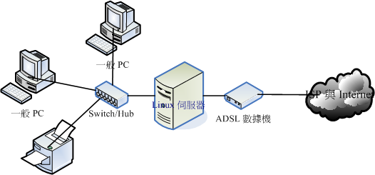

##网络状态查询

####1.常用网络查询指令
```
iostat          #显示一下目前整个系统的 CPU 与储存设备的状态
iostat -d 2 3 sda 
                #仅针对sda，每两秒钟侦测一次，并且共侦测三次储存设备
netstat -a      #网络状态
netstat -tlnp   #找出目前系统上已在监听的网络联机及其PID，tcp，listening，numeric，program
netstat -tulnp  #tcp,udp都显示出来

curl https://www.baidu.com  
                #网址的html会显示在屏幕上,这个方法也经常用于测试一台服务器是否可以到达一个网站
curl http://www.baidu.com >> /linux.html
curl -o /linux.html http://www.baidu.com
                #两条命令都是保存访问的网页
curl -o /dev/null -s -w %{http_code} www.baidu.com
                #测试网页返回的状态码，在脚本中，这是很常见的测试网站是否正常的用法

route -n        #查看路由信息
route add -net 192.168.5.0 \ > netmask 255.255.255.0 dev eth0    
                #增加一个路由，必须网卡能够联系的到
arp -n          #列出目前主机上面记载的 IP/MAC 对应的 ARP 表格
dmesg | grep -in eth       
                #观察核心所捉到的网卡信息
ifconfig        #查看ip相关信息
ifconfig wlp3s0 
                #查看wlp3s0这个网卡的相关信息
ifconfig wlp3s0:0 192.168.25.141  
                #那就是在该实体网卡上，再仿真一个网络接口
ifconfig wlp3s0:0 192.168.25.141 netmask 255.255.255.0 up
ifconfig eth0:0 down        
                #关掉 eth0:0 这个界面
/etc/init.d/network restart   
                #将手动的处理全部取消，使用原有的设定值重建网络参数


nmap localhost  #使用预设参数扫瞄本机所启用的 port (只会扫瞄 TCP)
nmap -sTU localhost           
                #同时扫瞄本机的 TCP/UDP 端口
nmap nmap -sP 192.168.1.0/24  
                #透过 ICMP 封包的检测，分析区网内有几部主机是启动的
nmap 192.168.1.0/24     
                #将各个主机的启动的 port 作一番侦测

traceroute -n www.baidu.com 
                #UDP:侦测本机到baidu去的各节点联机状态
traceroute -w 1 -n -T www.baidu.com 
                #TCP:侦测本机到baidu去的各节点联机状态
                
/etc/resolv.conf      
                #DNS 服务器地址查询
dig www.baidu.com  
                #查看DNS服务器配置是否成功
dig -x 120.114.100.20 
                #查询 120.114.100.20 的反解信息结果
whois baidu.com    
                #查询领域管理者相关信息
vim /etc/hosts  #增加ip对应的地址，如localhost

ping ip         #ping通常是用来检查网络是否通畅或者网络连接速度的命令
telnet ip port  #telnet是用来探测指定ip是否开放指定端口的
```


####2.SELinux
```
ls -Z           #观察安全性文本
getenforce      #查看SELinux是否开启，建议关闭，
                #enforcing：强制模式，代表 SELinux 运作中；disabled：关闭
vim /etc/selinux/config   
                #设置SELinux的开启和关闭，必须要重新启动
```


####3.iptables防火墙相关操作
```
systemctl status iptables                   # 查看防火墙的状态
systemctl stop iptables                     # 关闭防火墙
systemctl disable                           # 设置开启不自动启动
firewall-cmd --add-service="http"           # 防火墙
firewall-cmd --permanent --add-service="http"
firewall-cmd --list-all

输入firewall-cmd --query-port=6379/tcp，如果返回结果为no，那么证明6379端口确实没有开启。

输入firewall-cmd --add-port=6379/tcp，将6379端口开启，返回success。

**由于linux防火墙默认开启，redis的服务端口6379并不在开放规则之内，所有需要将此端口开放访问或者关闭防火墙。

**关闭防火墙命令：sevice iptables stop

**如果是修改防火墙规则，可以修改：/etc/sysconfig/iptables文件


iptables -t filter -L -n
iptables -t nat -L -n
#设定 lo 成为受信任的装置，亦即进出 lo 的封包都予以接受
iptables -A INPUT -i lo -j ACCEPT
iptables -A INPUT -i eth1 -j ACCEPT  #针对eth1网卡

filter (过滤器)：主要跟进入 Linux 本机的封包有关，这个是预设的table 喔！
o  INPUT：为来自外部，想要进入主机的封包；
o  OUTPUT：为来自主机，想要离开主机的封包；
o  FORWARD：为主机内部网域与外部网域的封包(不论进或者出)，但该封包不会进入主机。

nat (地址转换)：Network Address Translation， 这个表格主要在进行来源与目的之 IP 或 port 的转换，与 Linux 本机较无关，主要与Linux 主机后的局域网络内计算机较有相关。
o  PREROUTING：进行路由之前的封包传送过程
o  POSTROUTING：已经经过路由了，然后才进行的过滤规则。(SNAT/MASQUERADE)
o  OUTPUT：离开主机的封包传送过程；

Secure SHell protocol  SSH安全的壳程序协议=shell + ftp  
```


  


####4.ip地址的分类

```
  IP:设定为 192.168.100.1~192.168.100.253 ，但 IP 不可重复；
  Netmask：255.255.255.0
  Network：192.168.100.0、Broadcast：192.168.100.255
  Default Gateway：192.168.100.254 (路由器的 IP)
  DNS：暂时使用 168.95.1.1


IP 的分级：

Class A :
 0xxxxxxx.xxxxxxxx.xxxxxxxx.xxxxxxxx ==> NetI_D 的开头是 0
|--net--|---------host------------|

Class B :
 10xxxxxx.xxxxxxxx.xxxxxxxx.xxxxxxxx ==> NetI_D 的开头是 10
|------net-------|------host------|

Class C : 
110xxxxx.xxxxxxxx.xxxxxxxx.xxxxxxxx ==> NetI_D 的开头是

Class D : 
1110xxxx.xxxxxxxx.xxxxxxxx.xxxxxxxx ==> NetI_D 的开头是

Class E : 
1111xxxx.xxxxxxxx.xxxxxxxx.xxxxxxxx ==> NetI_D 的开头是

Class A : 0.xx.xx.xx ~ 127.xx.xx.xx
Class B : 128.xx.xx.xx ~ 191.xx.xx.xx
Class C : 192.xx.xx.xx ~ 223.xx.xx.xx
Class D : 224.xx.xx.xx ~ 239.xx.xx.xx
Class E : 240.xx.xx.xx ~ 255.xx.xx.xx

Class D 是用来作为群播(multicast) 的特殊功能之用 (最常用在大批计算机的网络还原)
Class E 则是保留没有使用的网段
能够用来设定在一般系统上面的，就只有 Class A, B, C三种等级的 IP

Public IP : 公共IP，经由INTERNIC所统一规划的IP，有这种IP才可以连上 Internet

Private IP : 不能直接连上 Internet 的IP，主要用于局域网络内的主机联机规划:
Class A：10.0.0.0 - 10.255.255.255
Class B：172.16.0.0 - 172.31.255.255
Class C：192.168.0.0 - 192.168.255.255

loopback IP 网段：127.0.0.1
没有安装网络卡在的机器上面， 但是你又希望可以测试一下在你的机器上面设定的服务器环境到底可不可以顺利运作


Netmask: 255.255.255.0 <==网域定义中，最重要的参数
Network: 192.168.0.0 <==指定第一个 IP，就可以计算出下面的数值
Broadcast: 192.168.0.255 <==最后一个 IP
可用以设定成为主机的 IP 数：
192.168.0.1 ~ 192.168.0.254
```


####5.HTTP状态码分类
```
HTTP状态码由三个十进制数字组成，第一个十进制数字定义了状态码的类型，后两个数字没有分类的作用。
HTTP状态码共分为5种类型：
分类	分类描述
1**	信息，服务器收到请求，需要请求者继续执行操作
2**	成功，操作被成功接收并处理
3**	重定向，需要进一步的操作以完成请求
4**	客户端错误，请求包含语法错误或无法完成请求
5**	服务器错误，服务器在处理请求的过程中发生了错误

200 OK请求已成功，请求所希望的响应头或数据体将随此响应返回。出现此状态码是表示正常状态。

304 自从上次请求后，请求的网页未修改过。服务器返回此响应时，不会返回网页内容，进而节省带宽和开销。
    如果网页自请求者上次请求后再也没有更改过，您应将服务器配置为返回此响应（称为 If-Modified-Since HTTP 标头）。
    
```
