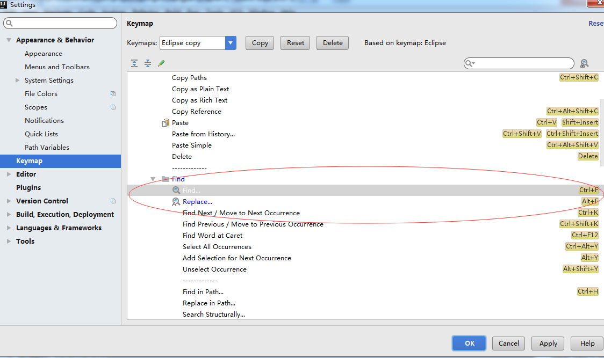
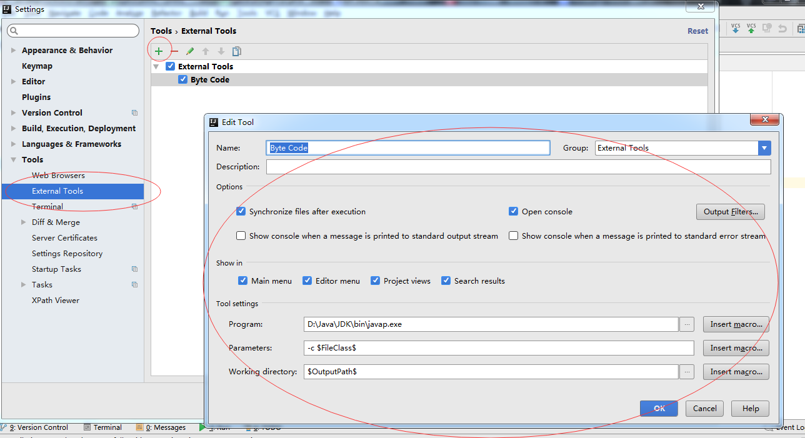
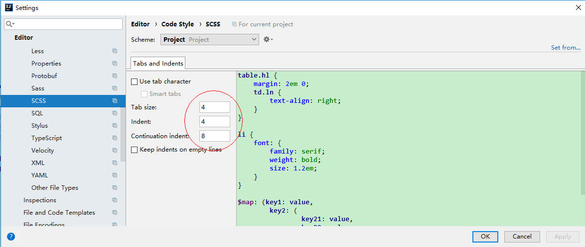
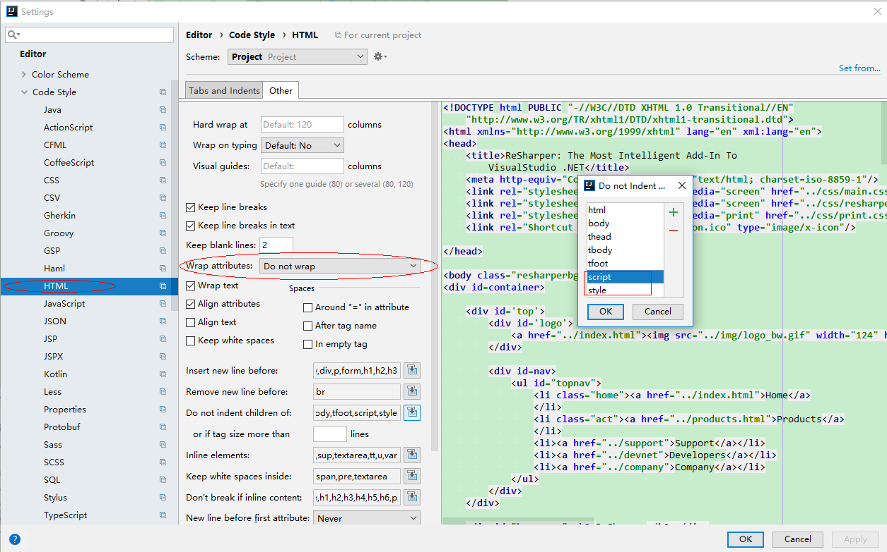
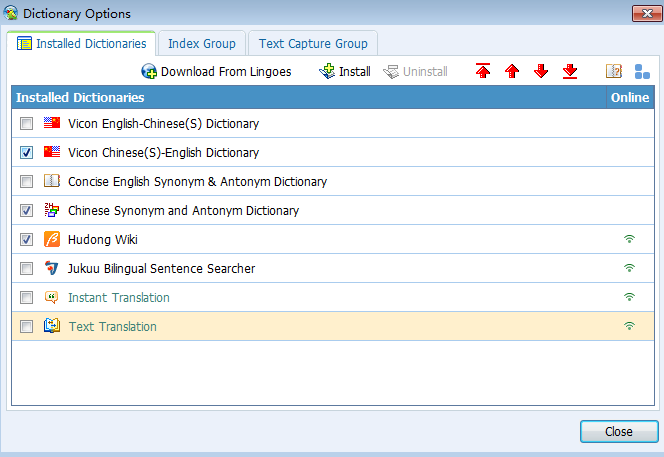

# 1.Java安装
```
安装JDK11
配置环境变量：JAVA_HOME      D:\Java\JDK    （JDK安装的目录，既bin层之上的目录）
              Path            %JAVA_HOME%\bin   （通过JAVA_HOME确定bin的目录）
在cmd命令中运行：java -version ,有结果返回则表示安装成功
```

# 2.git使用默认的安装，选择git bash only
```
安装好以后，在git bash中输入：git --version，有结果返回则表示安装成功
```

# 3.IntellJ使用默认的安装


## 3.1 参数配置：Help->edit custom
- 自定义idea参数，edit custom properties
````
# 控制台输出缓存
idea.cycle.buffer.size=disabled
# 设置可读文件大小
idea.max.intellisense.filesize=50000
````

- 自定义jvm参数，edit custom vm operation
```
-Xms1024m
-Xmx8192m
-XX:ReservedCodeCacheSize=512m


-Difile.encoding=UTF-8
-Duser.name=jaysunxiao
```


## 3.2 界面设置和编码设置（需要上面两步做完）
- 文件编码设置：File->Settings->Editor->File Encodings
```
Global Encoding:UTF-8
Projectt Encoding:UTF-8
Default encoding for properties files:UTF-8
```

- 工具栏：View->Tool Buttons

- 下面是绿色主题界面的设置，现在不需要了，用idea的原生白色界面


- 颜色设置：C7EDCC


- 设置左边对齐的颜色线的颜色，BBACED


- 左边可折叠栏目的颜色设置为粉红色

- 左边可折叠栏目的选中颜色设置为黑色

- 拼写错误改为纯蓝色


## 3.3 快捷键设置：Keymap->Eclipse


## 3.4 代码设置
- 设置类模板：Editor->File and Code Templates->Includes
```
/**
 * @author jaysunxiao
 * @since ${YEAR}-${MONTH}-${DAY} ${HOUR}:${MINUTE}
 * @version 1.0
 */
```

- Editor->Font
- Editor->Color Scheme->Console Font
```
Font->Consolas
Size->14
```

## 3.5 其它设置


#4 web相关设置及插件安装

## 4.1 nodejs安装，默认安装即可
```
查看npm是否安装成功：npm --version；  
查看nodejs是否安装成功：node --version；
```


### 4.2 服务器插件安装
- Alibaba Java Coding Guidelines
- Power Mode 2
- BashSupport
- Mongo Plugin
- zookeeper

### 4.3 web插件安装
- nodejs，将git的可执行文件目录添加到PATH环境变量：C:\Program Files\Git\cmd，要不然node识别不到
```
使用npm install安装需要的node module
安装完成后，在node module，和static上右键->mark Directory as->excluded
然后，File->Invalidate Cache/Restart
```
- vuej.s


- eslint


## 4.4 格式设置
- CSS格式设置


- JSON格式设置


- HTML格式设置



## 4.5 浏览器
1. Google浏览器为默认安装方法
2. 在google浏览器上安装vue devtools插件。
3. react devtools插件
4. WEB前端助手插件
5. ElasticSearch Head插件

## 5.Lingoes安装
- 在电脑管家上下载也可以，直接默认安装



```
在下面的文件夹下，将Lingoes English.zip解压到这个目录下
C:\Users\Administrator\AppData\Local\Lingoes\Translator\user_data\speech
重启Lingoes，在设置->语言中，选择声音，英语
```