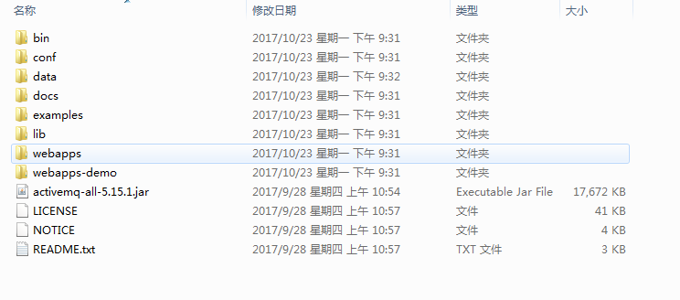
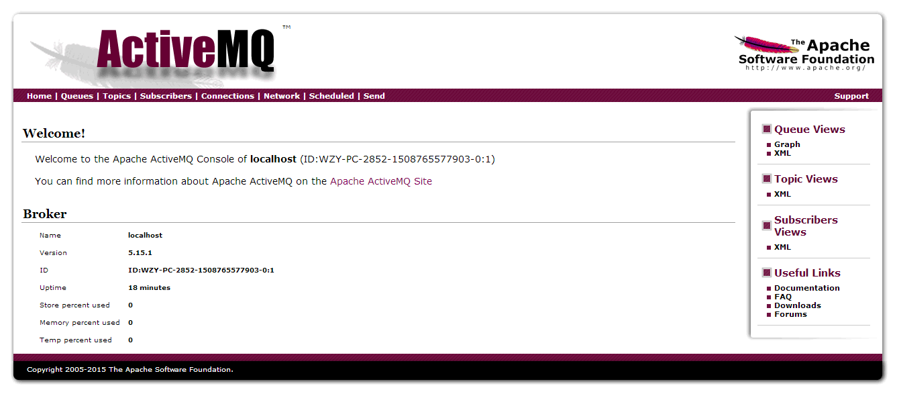
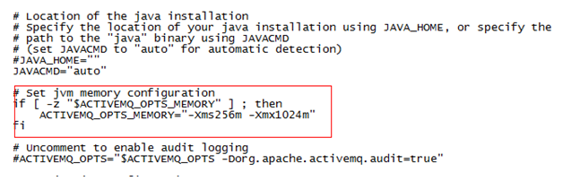
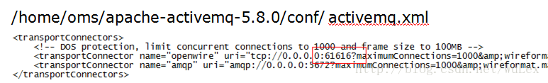

#ActiveMQ安装

##Windows
- 保证电脑上安装了jdk7以上版本的java，并配置了好环境变量
- 官方下载地址：http://activemq.apache.org/download-archives.html，这里使用 5.15.1
- 解压缩下载好的apache-activemq-5.15.1-bin.zip

- bin目录下由win32/ win64可以供选择，这里是进入 win64 ，运行activemq.bat 脚本
- 进入ActiveMQ控制台界面了，默认启动到8161端口，在浏览器地址栏输入：http://localhost:8161/admin，默认用户名密码为admin、admin
- 登录用户名密码可在 conf/jetty-realm.properties 文件中修改

- 服务端默认端口是61616，我们程序中配置文件按照如下方式配置
```
<bean id="targetConnectionFactory" class="org.apache.activemq.ActiveMQConnectionFactory">
        <!--property name="brokerURL" value="failover:tcp://10.0.26.71:61616" /> -->
        <property name="brokerURL" value="failover:tcp://127.0.0.1:61616" />
</bean>
```

##Linux
- 复制apache-activemq-5.8.0-bin.tar.gz至服务器目录，比如我们放在/home/oms目录下
```
然后tar -zxvf apache-activemq-5.8.0-bin.tar.gz解压至当前文件夹，解压完成activemq目录为/home/oms/apache-activemq-5.8.0
```
- 修改JVM配置，/home/apache-activemq-5.8.0/bin/activemq

- 修改服务端端口（默认值为61616）

- 进入/home/oms/apache-activemq-5.8.0/bin
```
启动命令为activemq start
停止命令为activemq stop
查看运行状态命令为activemq status
```
