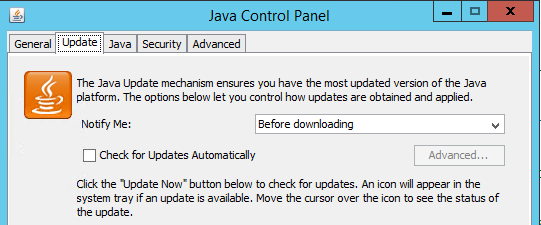
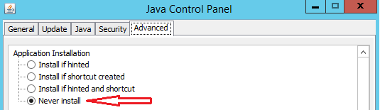

#安装

##Windows
- 安装Java环境
- 禁用Java JDK的自动更新，由于ElasticSearch收到JRE版本影响，必须禁止JRE的自动更新。
```
在控制面板（Control Panel）上点击Java图标，
打开Java控制面板，切换到Update 选项卡（tab），取消选择“Check for Updates Automatically”，禁止系统自动进行JDR的自动更新。
```



- 安装ElasticSearch，在安装Java JDK，配置JAVA_HOME环境变量之后，就可以安装Elasticsearch全文搜索引擎了，首先需要下载特定版本的ES安装文件。
- 下载ElasticSearch最新版本，这里是6.5.4，从官方下载中心 ElasticSearch Download 下载ElasticSearch安装包，并解压
- 进入解压的bin/目录，双击执行 elasticsearch.bat，该脚本文件执行 ElasticSearch 安装程序
- 稍等片刻，打开浏览器，输入 http://localhost:9200，有回应说明安装成功
- 安装head插件，ES6.0.0版本以后的版本，直接在Chrome的应用中心安装ElasticSearch Head插件，使用这个插件就可以连接到ES
- 安装elasticsearch-analysis-ik插件
```
elasticsearch-6.5.4\bin>elasticsearch-plugin install https://github.com/medcl/elasticsearch-analysis-ik/releases/download/v6.5.0/elasticsearch-analysis-ik-6.5.0.zip
```
