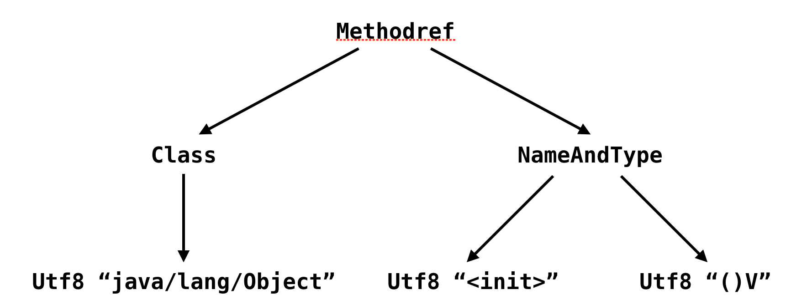

####javap
- javac Foo.java
```
public class Foo {
  private int tryBlock;
  private int catchBlock;
  private int finallyBlock;
  private int methodExit;

  public void test() {
    try {
      tryBlock = 0;
    } catch (Exception e) {
      catchBlock = 1;
    } finally {
      finallyBlock = 2;
    }
    methodExit = 3;
  }
}
```
- 编译过后，javap -p -v Foo
    - 第一个选项是 -p。默认情况下 javap 会打印所有非私有的字段和方法，当加了 -p 选项后，它还将打印私有的字段和方法。
    - 第二个选项是 -v。它尽可能地打印所有信息。如果你只需要查阅方法对应的字节码，那么可以用 -c 选项来替换 -v。
```
$ javac Foo.java
$ javap -p -v Foo
Classfile ../Foo.class
  Last modified ..; size 541 bytes
  MD5 checksum 3828cdfbba56fea1da6c8d94fd13b20d
  Compiled from "Foo.java"
public class Foo
  minor version: 0
  major version: 54
  flags: (0x0021) ACC_PUBLIC, ACC_SUPER
  this_class: #7                          // Foo
  super_class: #8                         // java/lang/Object
  interfaces: 0, fields: 4, methods: 2, attributes: 1
Constant pool:
   #1 = Methodref          #8.#23         // java/lang/Object."<init>":()V
   #2 = Fieldref           #7.#24         // Foo.tryBlock:I
   #3 = Fieldref           #7.#25         // Foo.finallyBlock:I
   #4 = Class              #26            // java/lang/Exception
   #5 = Fieldref           #7.#27         // Foo.catchBlock:I
   #6 = Fieldref           #7.#28         // Foo.methodExit:I
   #7 = Class              #29            // Foo
   #8 = Class              #30            // java/lang/Object
   #9 = Utf8               tryBlock
  #10 = Utf8               I
  #11 = Utf8               catchBlock
  #12 = Utf8               finallyBlock
  #13 = Utf8               methodExit
  #14 = Utf8               <init>
  #15 = Utf8               ()V
  #16 = Utf8               Code
  #17 = Utf8               LineNumberTable
  #18 = Utf8               test
  #19 = Utf8               StackMapTable
  #20 = Class              #31            // java/lang/Throwable
  #21 = Utf8               SourceFile
  #22 = Utf8               Foo.java
  #23 = NameAndType        #14:#15        // "<init>":()V
  #24 = NameAndType        #9:#10         // tryBlock:I
  #25 = NameAndType        #12:#10        // finallyBlock:I
  #26 = Utf8               java/lang/Exception
  #27 = NameAndType        #11:#10        // catchBlock:I
  #28 = NameAndType        #13:#10        // methodExit:I
  #29 = Utf8               Foo
  #30 = Utf8               java/lang/Object
  #31 = Utf8               java/lang/Throwable
{
  private int tryBlock;
    descriptor: I
    flags: (0x0002) ACC_PRIVATE

  private int catchBlock;
    descriptor: I
    flags: (0x0002) ACC_PRIVATE

  private int finallyBlock;
    descriptor: I
    flags: (0x0002) ACC_PRIVATE

  private int methodExit;
    descriptor: I
    flags: (0x0002) ACC_PRIVATE

  public Foo();
    descriptor: ()V
    flags: (0x0001) ACC_PUBLIC
    Code:
      stack=1, locals=1, args_size=1
         0: aload_0
         1: invokespecial #1                  // Method java/lang/Object."<init>":()V
         4: return
      LineNumberTable:
        line 1: 0

  public void test();
    descriptor: ()V
    flags: (0x0001) ACC_PUBLIC
    Code:
      stack=2, locals=3, args_size=1
         0: aload_0
         1: iconst_0
         2: putfield      #2                  // Field tryBlock:I
         5: aload_0
         6: iconst_2
         7: putfield      #3                  // Field finallyBlock:I
        10: goto          35
        13: astore_1
        14: aload_0
        15: iconst_1
        16: putfield      #5                  // Field catchBlock:I
        19: aload_0
        20: iconst_2
        21: putfield      #3                  // Field finallyBlock:I
        24: goto          35
        27: astore_2
        28: aload_0
        29: iconst_2
        30: putfield      #3                  // Field finallyBlock:I
        33: aload_2
        34: athrow
        35: aload_0
        36: iconst_3
        37: putfield      #6                  // Field methodExit:I
        40: return
      Exception table:
         from    to  target type
             0     5    13   Class java/lang/Exception
             0     5    27   any
            13    19    27   any
      LineNumberTable:
        line 9: 0
        line 13: 5
        line 14: 10
        line 10: 13
        line 11: 14
        line 13: 19
        line 14: 24
        line 13: 27
        line 14: 33
        line 15: 35
        line 16: 40
      StackMapTable: number_of_entries = 3
        frame_type = 77 /* same_locals_1_stack_item */
          stack = [ class java/lang/Exception ]
        frame_type = 77 /* same_locals_1_stack_item */
          stack = [ class java/lang/Throwable ]
        frame_type = 7 /* same */
}
SourceFile: "Foo.java"
```

- javap 的 -v 选项的输出分为几大块。
- 基本信息，涵盖了原 class 文件的相关信息。
```
class 文件的版本号（minor version: 0，major version: 54）(编译生成该 class 文件时所用的 JRE 版本)
该类的访问权限（flags: (0x0021) ACC_PUBLIC, ACC_SUPER），
该类（this_class: #7）以及父类（super_class: #8）的名字，
所实现接口（interfaces: 0）、字段（fields: 4）、方法（methods: 2）以及属性（attributes: 1）的数目。
这里属性指的是 class 文件所携带的辅助信息，比如该 class 文件的源文件的名称。
这类信息通常被用于 Java 虚拟机的验证和运行，以及 Java 程序的调试，一般无须深入了解。

Classfile ../Foo.class
Last modified ..; size 541 bytes
MD5 checksum 3828cdfbba56fea1da6c8d94fd13b20d
Compiled from "Foo.java"
public class Foo
minor version: 0
major version: 54
flags: (0x0021) ACC_PUBLIC, ACC_SUPER
this_class: #7                          // Foo
super_class: #8                         // java/lang/Object
interfaces: 0, fields: 4, methods: 2, attributes: 1
```
    
- 常量池，用来存放各种常量以及符号引用。
```
常量池中的每一项都有一个对应的索引（如 #1），并且可能引用其他的常量池项（#1 = Methodref #8.#23）。

Constant pool:
   #1 = Methodref          #8.#23         // java/lang/Object."<init>":()V
... 
   #8 = Class              #30            // java/lang/Object
...
  #14 = Utf8               <init>
  #15 = Utf8               ()V
...
  #23 = NameAndType        #14:#15        // "<init>":()V
...
  #30 = Utf8               java/lang/Object
举例来说，1 号常量池项是一个指向 Object 类构造器的符号引用。它是由另外两个常量池项所构成。
如果将它看成一个树结构的话，那么它的叶节点会是字符串常量，如下图所示。
```


- 字段区域，用来列举该类中的各个字段。
```
这里最主要的信息便是该字段的类型（descriptor: I）以及访问权限（flags: (0x0002) ACC_PRIVATE）。
对于声明为 final 的静态字段而言，如果它是基本类型或者字符串类型，那么字段区域还将包括它的常量值。
Java 虚拟机同样使用了“描述符”（descriptor）来描述字段的类型。

  private int tryBlock;
    descriptor: I
    flags: (0x0002) ACC_PRIVATE
```

- 方法区域，用来列举该类中的各个方法。
```
除了方法描述符以及访问权限之外，每个方法还包括最为重要的代码区域（Code:)。
代码区域一开始会声明该方法中的操作数栈（stack=2）和局部变量数目（locals=3）的最大值，以及该方法接收参数的个数（args_size=1）。
注意这里局部变量指的是字节码中的局部变量，而非 Java 程序中的局部变量。
接下来则是该方法的字节码。每条字节码均标注了对应的偏移量（bytecode index，BCI），这是用来定位字节码的。
比如说偏移量为 10 的跳转字节码 10: goto 35，将跳转至偏移量为 35 的字节码 35: aload_0。

  public void test();
    descriptor: ()V
    flags: (0x0001) ACC_PUBLIC
    Code:
      stack=2, locals=3, args_size=1
         0: aload_0
...
        10: goto          35
...
        34: athrow
        35: aload_0
...
        40: return
      Exception table:
         from    to  target type
             0     5    13   Class java/lang/Exception
             0     5    27   any
            13    19    27   any
      LineNumberTable:
        line 9: 0
...
        line 16: 40
      StackMapTable: number_of_entries = 3
        frame_type = 77 /* same_locals_1_stack_item */
          stack = [ class java/lang/Exception ]
...

```

- 紧跟着的异常表（Exception table:）
```
异常表也会使用偏移量来定位每个异常处理器所监控的范围（由 from 到 to 的代码区域），以及异常处理器的起始位置（target）。
除此之外，它还会声明所捕获的异常类型（type）。其中，any 指代任意异常类型。
```

- 再接下来的行数表（LineNumberTable:）
```
行数表则是 Java 源程序到字节码偏移量的映射。如果你在编译时使用了 -g 参数（javac -g Foo.java），
那么这里还将出现局部变量表（LocalVariableTable:），展示 Java 程序中每个局部变量的名字、类型以及作用域。
    LocalVariableTable:
    Start  Length  Slot  Name   Signature
       14       5     1     e   Ljava/lang/Exception;
        0      41     0  this   LFoo;
```

- 最后则是字节码操作数栈的映射表（StackMapTable: number_of_entries = 3）
```
该表描述的是字节码跳转后操作数栈的分布情况，一般被 Java 虚拟机用于验证所加载的类，以及即时编译相关的一些操作，正常情况下，你无须深入了解。

```
