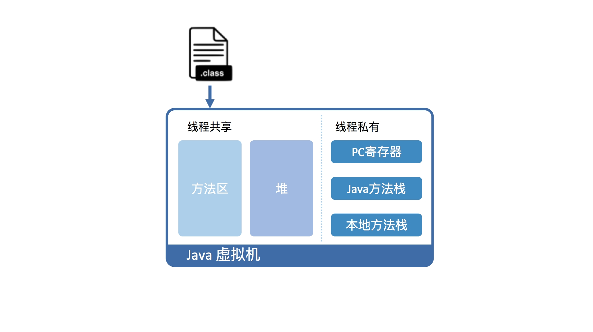
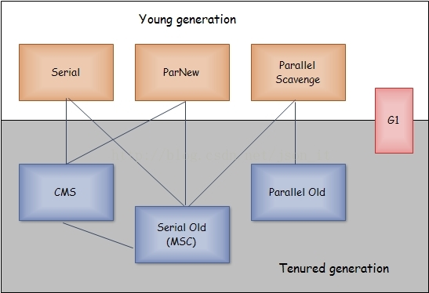

##一.JVM概述

####发展历史
* 1996年1月	JDK1.0发布
* 2006年12月	JRE6.0发布
* 2009年4月	Oracle收购Sun
* 2011年7月	JavaSE7发布
* 2014年3月	JavaSE8发布

####安装jdk
```
yum install java-1.8.0-openjdk-devel.x86_64  
vi  /etc/profile   让系统上的所有用户使用java(openjdk) ,则要进行下面的操作：  


将下面的三行粘贴到 /etc/profile 中：  

export JAVA_HOME=/usr/lib/jvm/java-1.8.0-openjdk-1.8.0.71-2.b15.el7_2.x86_64  
export PATH=$PATH:$JAVA_HOME/bin  


输入以下命令，来确认这三个变量是否设成了我们想要的：  

echo $JAVA_HOME  
echo $PATH  


如果通过官网下载的.tar.gz文件，需要拷贝到/opt目录  
tar -xzvf jdk-8u40-linux-i586.tar.gz  
export JAVA_HOME=/opt/jdk1.8.0/   
export PATH=$JAVA_HOME/bin  
```

####安装jps等工具
```
yum install -y java-1.8.0-openjdk-devel


//l:输出主类的全名；v：输出jvm启动时的参数  
jps -l


//每250ms查询一次进程15485垃圾收集状况，一共查询20次   
jstat -gc 15485 250 20


//生成进程15485堆转储快照文件   
jmap -dump:format=b,file=idea.dumpfile 15485


//跟踪进程15485并打印堆栈信息   
jstack -l 15485
```

##二.JVM基础

####JVM如何运行Java字节码？
- 软件角度
1. 首先需要将Java代码编译成class文件
2. 将class文件加载到Java虚拟机中
3. 加载后的Java类会被存放于方法区（Method Area）中。实际运行时，虚拟机会执行方法区内的代码。
```
在运行过程中，每当调用进入一个 Java 方法，Java 虚拟机会在当前线程的 Java 方法栈中生成一个栈帧（interpreted frame），用以存放局部变量以及字节码的操作数。
这个栈帧的大小是提前计算好的，而且 Java 虚拟机不要求栈帧在内存空间里连续分布。
当退出当前执行的方法时，不管是正常返回还是异常返回，Java 虚拟机均会弹出当前线程的当前栈帧，并将之舍弃。
```


- 硬件角度
```
从硬件视角来看，Java 字节码无法直接执行。因此，Java 虚拟机需要将字节码翻译成机器码。
在 HotSpot 里面，上述翻译过程有两种形式：
    第一种是解释执行，即逐条将字节码翻译成机器码并执行；
    第二种是即时编译（Just-In-Time compilation，JIT），即将一个方法中包含的所有字节码编译成机器码后再执行。
前者的优势在于无需等待编译，而后者的优势在于实际运行速度更快。
HotSpot 默认采用混合模式，综合了解释执行和即时编译两者的优点。它会先解释执行字节码，而后将其中反复执行的热点代码，以方法为单位进行即时编译。
热点代码有两种算法，基于采样的热点探测和基于计数器的热点探测。Java采用的都是基于计数器的热点探测。
基于计数器的热点探测又有两个计数器，方法调用计数器，回边计数器，他们在C1和C2又有不同的阈值。
```


####栈帧是怎么定义的？
- 栈帧有两个主要的组成部分，分别是局部变量区，以及字节码的操作数栈
```
这里的局部变量是广义的，除了普遍意义下的局部变量之外，它还包含实例方法的“this 指针”以及方法所接收的参数。局部变量区等价于一个数组，并且可以用正整数来索引。
long、double用两个数组单元来存储，boolean、byte、char、short，int用四个字节存储。（因为变长数组不好控制，以空间换时间的做法）
因此，在 32 位的 HotSpot 中，这些类型在栈上将占用 4 个字节；而在 64 位的 HotSpot 中，他们将占 8 个字节。
对于 byte、char 以及 short 这三种类型的字段或者数组单元，它们在堆上占用的空间分别为一字节、两字节，以及两字节，也就是说，跟这些类型的值域相吻合。
```

####JVM运行效率如何？
```
即时编译建立在程序符合二八定律的假设上，也就是百分之二十的代码占据了百分之八十的计算资源。
理论上讲，即时编译后的 Java 程序的执行效率，是可能超过 C++ 程序的。这是因为与静态编译相比，即时编译拥有程序的运行时信息，并且能够根据这个信息做出相应的优化。
举个例子，我们知道虚方法是用来实现面向对象语言多态性的。对于一个虚方法调用，尽管它有很多个目标方法，但在实际运行过程中它可能只调用其中的一个。
这个信息便可以被即时编译器所利用，来规避虚方法调用的开销，从而达到比静态编译的 C++ 程序更高的性能。
编译之后的指令需要保存在内存中，这种方式吃内存，按照二八原则这种混合模式最恰当。
```

####即时编译的编译器
- C1：又叫Client编译器，面向的是对启动性能有要求的客户端GUI程序，采用的优化手段相对简单，因此编译时间较短。
- C2：又叫Server编译器，面向的是对峰值性能有要求的服务器端程序，采用的优化手段相对复杂，因此编译时间较长，但同时生成代码的执行效率较高。
- Graal：Java 10 正式引入的实验性即时编译器。
```
HotSpot 装载了多个不同的即时编译器，以便在编译时间和生成代码的执行效率之间做取舍。
从 Java 7 开始，HotSpot 默认采用分层编译的方式：热点方法首先会被 C1 编译，而后热点方法中的热点会进一步被 C2 编译。
为了不干扰应用的正常运行，HotSpot 的即时编译是放在额外的编译线程中进行的。HotSpot 会根据 CPU 的数量设置编译线程的数目，并且按 1:2 的比例配置给 C1 及 C2 编译器。
在计算资源充足的情况下，字节码的解释执行和即时编译可同时进行。编译完成后的机器码会在下次调用该方法时启用，以替换原本的解释执行。
JVM有两种编译方式，整个方法进行编译，或者对热循环进行编译。后面那种涉及到一个叫on stack replacement的技术。不论是那种，都要比if else的粒度大。
事实上JVM确实有考虑做AOT (ahead of time compilation) 这种事情。AOT能够在线下将Java字节码编译成机器码，主要是用来解决启动性能不好的问题。但是牺牲了跨平台。
```

####JVM如何加载类？
- 从 class 文件到内存中的类，按先后顺序需要经过加载、链接以及初始化三大步骤。在程序内生成的类或者远程加载的类没有经过初始化，同样不能使用。

- 加载，是指查找字节流，并且据此创建类的过程。
```
对于数组类来说，它没有对应的字节流，由 Java 虚拟机直接生成的。对于类来说，Java 虚拟机则需要借助类加载器来完成查找字节流的过程。
每当一个类加载器接收到加载请求时，它会先将请求转发给父类加载器。在父类加载器没有找到所请求的类的情况下，该类加载器才会尝试去加载。这叫双亲委派模型。

启动类加载器（boot class loader）。启动类加载器是由 C++ 实现的，没有对应的 Java 对象，因此在 Java 中只能用 null 来指代。
负责加载最为基础、最为重要的类，比如存放在 JRE 的 lib 目录下 jar 包中的类（以及由虚拟机参数 -Xbootclasspath 指定的类）。

扩展类加载器（extension class loader），父类加载器是启动类加载器，由 Java 核心类库提供。
它负责加载相对次要、但又通用的类，比如存放在 JRE 的 lib/ext 目录下 jar 包中的类（以及由系统变量 java.ext.dirs 指定的类）。
Java 9 引入了模块系统，扩展类加载器被改名为平台类加载器（platform class loader），
Java SE 中除了少数几个关键模块，比如说 java.base 是由启动类加载器加载之外，其他的模块均由平台类加载器所加载。

应用类加载器（application class loader），均由 Java 核心类库提供。
它负责加载应用程序路径下的类。（这里的应用程序路径，便是指虚拟机参数 -cp/-classpath、系统变量 java.class.path 或环境变量 CLASSPATH 所指定的路径。）
默认情况下，应用程序中包含的类便是由应用类加载器加载的。

在 Java 虚拟机中，类的唯一性是由类加载器实例以及类的全名一同确定的。即便是同一串字节流，经由不同的类加载器加载，也会得到两个不同的类。
在大型应用中，我们往往借助这一特性，来实现热部署实现，如Tomcat就自定义了一个自己的类加载器。
```
- 链接，是指将创建成的类合并至 Java 虚拟机中，使之能够执行的过程。它可分为验证、准备以及解析三个阶段。
```
验证阶段的目的，在于确保被加载类能够满足 Java 虚拟机的约束条件。

准备阶段的目的，则是为被加载类的静态字段分配内存。Java 代码中对静态字段的具体初始化，则会在稍后的初始化阶段中进行。

解析阶段的目的，正是将这些符号引用解析成为实际引用。
如果符号引用指向一个未被加载的类，或者未被加载类的字段或方法，那么解析将触发这个类的加载（但未必触发这个类的链接以及初始化。）
```
- 初始化，则是为标记为常量值的字段赋值，以及执行 < clinit > 方法的过程。类的初始化仅会被执行一次，这个特性被用来实现单例的延迟初始化。
```
如果直接赋值的静态字段被 final 所修饰，并且它的类型是基本类型或字符串时，那么该字段便会被 Java 编译器标记成常量值（ConstantValue），
其初始化直接由 Java 虚拟机完成。除此之外的直接赋值操作，以及所有静态代码块中的代码，则会被 Java 编译器置于同一方法中，并把它命名为 < clinit >。
类加载的最后一步是初始化，便是为标记为常量值的字段赋值，以及执行 < clinit > 方法的过程。
Java 虚拟机会通过加锁来确保类的 < clinit > 方法仅被执行一次，所以类初始化是线程安全的。
```

####JVM如何调用方法？
```
Java 虚拟机识别方法的关键在于类名、方法名以及方法描述符（method descriptor）。（方法描述符由方法的参数类型以及返回类型所构成。）
由于字节码所附带的方法描述符包含了返回类型，因此 Java 虚拟机能够准确地识别目标方法。
在同一个类中，如果同时出现多个名字相同且描述符也相同的方法，那么 Java 虚拟机会在类的验证阶段报错。

重载也被称为静态绑定（static binding），或者编译时多态（compile-time polymorphism）；而重写则被称为动态绑定（dynamic binding）。
前者在JVM中的指令是invokestatic，后者是invokedynamic

在编译过程中，我们并不知道目标方法的具体内存地址。
因此，Java 编译器会暂时用符号引用来表示该目标方法。这一符号引用包括目标方法所在的类或接口的名字，以及目标方法的方法名和方法描述符。

经过上述的解析步骤之后，符号引用会被解析成实际引用。对于可以静态绑定的方法调用而言，实际引用是一个指向方法的指针。
对于需要动态绑定的方法调用而言，实际引用则是一个方法表的索引，它是 Java 虚拟机实现动态绑定的关键所在，紧紧用在解释执行的过程中。
这是因为即时编译还拥有另外两种性能更好的优化手段：内联缓存（inlining cache）和方法内联（method inlining）。

内联缓存是一种加快动态绑定的优化技术。它能够缓存虚方法调用中调用者的动态类型，以及该类型所对应的目标方法。
在之后的执行过程中，如果碰到已缓存的类型，内联缓存便会直接调用该类型所对应的目标方法。如果没有碰到已缓存的类型，内联缓存则会退化至使用基于方法表的动态绑定。

内联函数就是在程序编译时，编译器将程序中出现的内联函数的调用表达式用内联函数的函数体来直接进行替换。
如果JVM监测到一些小方法被频繁的执行，它会把方法的调用替换成方法体本身。
Java不支持直接声明为内联函数的，如果想让他内联，你只能够向编译器提出请求: 关键字final修饰 用来指明那个函数是希望被JVM内联的，例：
    public final void doSomething() {  
            // to do something  
    } 
    
```

####JVM异常概述
```
在 Java 语言规范中，所有异常都是 Throwable 类或者其子类的实例。Throwable 有两大直接子类：
    第一个是 Error，涵盖程序不应捕获的异常。当程序触发 Error 时，它的执行状态已经无法恢复，需要中止线程甚至是中止虚拟机。
    第二子类则是 Exception，涵盖程序可能需要捕获并且处理的异常。
    
异常实例的构造十分昂贵。这是由于在构造异常实例时，Java 虚拟机便需要生成该异常的栈轨迹（stack trace）。
该操作会逐一访问当前线程的 Java 栈帧，并且记录下各种调试信息，包括栈帧所指向方法的名字，方法所在的类名、文件名，以及在代码中的第几行触发该异常。

既然异常实例的构造十分昂贵，我们是否可以缓存异常实例，在需要用到的时候直接抛出呢？从语法角度上来看，这是允许的。
然而，该异常对应的栈轨迹并非 throw 语句的位置，而是新建异常的位置。
```

####JVM如何捕获异常？
- 在编译生成的字节码中，每个方法都附带一个异常表。
- 异常表中的每一个条目代表一个异常处理器，并且由 from 指针、to 指针、target 指针以及所捕获的异常类型构成。
- 这些指针的值是字节码索引（bytecode index，bci），用以定位字节码。
```
public static void main(String[] args) {
  try {
    mayThrowException();
  } catch (Exception e) {
    e.printStackTrace();
  }
}
// 对应的 Java 字节码
// from 指针和 to 指针标示了该异常处理器所监控的范围，例如 try 代码块所覆盖的范围。
// target 指针则指向异常处理器的起始位置，例如 catch 代码块的起始位置。
public static void main(java.lang.String[]);
  Code:
    0: invokestatic mayThrowException:()V
    3: goto 11
    6: astore_1
    7: aload_1
    8: invokevirtual java.lang.Exception.printStackTrace
   11: return
  Exception table:
    from  to target type
      0   3   6  Class java/lang/Exception  // 异常表条目


```

####反射调用如何实现的？
```
如果你查阅 Method.invoke 的源代码，那么你会发现，它实际上委派给 MethodAccessor 来处理。
MethodAccessor 是一个接口，它有两个已有的具体实现：一个通过本地方法来实现反射调用，另一个则使用了委派模式。

本地实现：
动态实现和本地实现相比，其运行效率要快上 20 倍。这是因为动态实现无需经过 Java 到 C++ 再到 Java 的切换，
但由于生成字节码十分耗时，仅调用一次的话，反而是本地实现要快上 3 到 4 倍。

委派实现：
Java 的反射调用机制还设立了另一种动态生成字节码的实现（下称动态实现），直接使用 invoke 指令来调用目标方法。

考虑到许多反射调用仅会执行一次，Java 虚拟机设置了一个阈值 15（可以通过 -Dsun.reflect.inflationThreshold= 来调整）。
当某个反射调用的调用次数在 15 之下时，采用本地实现；
当达到 15 时，便开始动态生成字节码，并将委派实现的委派对象切换至动态实现，这个过程我们称之为 Inflation。
执行15次会编译动态生成字节码，当该方法预热到一定程度会被即时编译成方法内联，这个时候可以达到和普通方法一样的速度，达到反射的峰值。

反射调用的 Inflation 机制是可以通过参数（-Dsun.reflect.noInflation=true）来关闭的。
这样一来，在反射调用一开始便会直接生成动态实现，而不会使用委派实现或者本地实现。

```


####什么时候触发Minor GC?什么时候触发Full GC?
1.触发Minor GC(Young GC)
虚拟机在进行Minor GC之前会判断老年代最大的可用连续空间是否大于新生代的所有对象总空间。  
所有的Minor GC和Full GC都会触发全世界的暂停（stop-the-world），停止应用程序的线程，前者非常短暂，后者时间长，约慢10倍。  

    1).如果大于的话，直接执行minorGC
    2).如果小于，判断是否开启HandlerPromotionFailure，没有开启直接FullGC
    3).如果开启了HanlerPromotionFailure, JVM会判断老年代的最大连续内存空间是否大于历次晋升的大小，如果小于直接执行FullGC

2.触发FullGC

    1).老年代空间不足
    如果创建一个大对象，Eden区域当中放不下这个大对象，会直接保存在老年代当中，如果老年代空间也不足，就会触发Full GC。为了避免这种情况，最好就是不要创建太大的对象。
    2).永久带空间不足
    如果有永久带空间的话，系统当中需要加载的类，调用的方法很多，同时持久代当中没有足够的空间，就出触发一次Full GC
    3).YGC出现promotion failure
    promotion failure发生在Young GC, 如果Survivor区当中存活对象的年龄达到了设定值，会就将Survivor区当中的对象拷贝到老年代，如果老年代的空间不足，就会发生promotion failure， 接下去就会发生Full GC.
    4).统计YGC发生时晋升到老年代的平均总大小大于老年代的空闲空间
    在发生YGC是会判断，是否安全，这里的安全指的是，当前老年代空间可以容纳YGC晋升的对象的平均大小，如果不安全，就不会执行YGC,转而执行Full GC。
    5).显示调用System.gc

到目前为止JVM还没有明确的定义Full GC和Minor GC。许多Full GC是由Minor GC触发的，所以很多情况下将这两种GC分离是不太可能的。  
这使得我们不用去关心到底是叫Full GC还是Minor GC，大家应该关注当前的GC是否停止了所有应用程序的线程，还是能够并发的处理而不用停掉应用程序的线程。  
    
####Java中垃圾回收算法有哪些？
1.标记-清除算法
分为标记、清除两个阶段，标记所有需要回收的对象，在标记完成之后统一回收所有被标记的对象。  
缺点：标记和清除两个阶段的效率都不高；产生大量的内存碎片；  

2.2、复制算法[新生代]
为了解决效率问题，一种被成为“复制”的收集算法出现了。  
将可用内存分为两个大小相等的两块，每次只使用其中的一块。  
当这一块内存使用完了，就将还存活的对象复制到另一块上面，然后再把使用过的内存空间一次清理掉。这样使得每次都是对整个半区进行内存回收。  
解决了内存碎片过多的问题，但是代价是可使用内存缩小为原来的一半，未免有点太高了。而且当存活对象较多的时候，会进行较多的复制操作。  
【现在的商业虚拟机都采用这种收集算法来回收新生代[老年代不使用这种算法，因为需要分配担保]，  IBM研究表明新生代中的对象98%是“朝生夕死”的，  
所以并不需要按照1:1的比例来划分内存空间，而是将内存分为一块较大的Eden和两块较小的Survivor空间，每次使用Eden和其中一块Survivor。  
当回收时，将Eden和Survivor中还存活的对象一次性复制到另一块Survivor空间上，最后清理掉Eden和刚才用过的Survivor空间。  
HotSpot虚拟机默认Eden和Survivor的大小比例是8：1，也就是每次新生代中可用内存空间为整个新生代容量的90%，只有10%被浪费掉。  
当Survivor空间不够的时候，需要依赖其他内存（这里指老年代）进行分配担保，这里所谓的担保就是当另一块Survivor空间不足以存放上一次新生代收集下来的存活对象时，这些对象将直接通过分配担保机制进入老年代】  

2.3、标记-整理算法[老年代]
标记过程仍然与“标记-清除”算法一样，但后续步骤不是直接对可回收对象进行清除，而是让所有存活的对象都向一端移动，然后直接清理掉边界以外的内存。  

2.4、分代收集算法
一般Java堆分为新生代和老年代。  
新生代：在新生代中，每次垃圾收集都会发现大批对象死去，只有少量存活，因此使用复制算法。  
老年代：对象的存活率高、没有额外空间对它进行分配担保，就必须使用“标记-清除”或者“标记-整理”算法进行回收。  
【GC进行时必须停顿所有Java执行线程】  
以上只是垃圾收集的算法思想，在JVM中真正落地实现垃圾回收动作的还是GC收集器，而且通常虚拟机中往往不止有一种GC收集器。  




jdk1.8 默认垃圾收集器Parallel Scavenge（新生代）+Parallel Old（老年代），jdk1.9 默认垃圾收集器G1。  

ParallelScavenge收集器的目标则是达到一个可控制的吞吐量（Throughput）。所谓吞吐量就是CPU用于运行用户代码的时间与CPU总消耗时间的比值，即吞吐量 = 运行用户代码时间 /（运行用户代码时间 + 垃圾收集时间）。  
-XX:MaxGCPauseMillis：控制最大垃圾收集停顿时间的参数，收集器将尽力保证内存回收花费的时间不超过设定值。  
不过大家不要异想天开地认为如果把这个参数的值设置得稍小一点就能使得系统的垃圾收集速度变得更快，GC停顿时间缩短是以牺牲吞吐量和新生代空间来换取的：系统把新生代调小一些，  
收集300MB新生代肯定比收集500MB快吧，这也直接导致垃圾收集发生得更频繁一些，原来10秒收集一次、每次停顿100毫秒，现在变成5秒收集一次、每次停顿70毫秒。停顿时间的确在下降，但吞吐量也降下来了。   
-XX:GCTimeRatio：直接设置吞吐量大小，参数的值应当是一个大于0小于100的整数，也就是垃圾收集时间占总时间的比率，相当于是吞吐量的倒数。  
如果把此参数设置为19，那允许的最大GC时间就占总时间的5%（即1 /（1+19）），默认值为99，就是允许最大1%（即1 /（1+99））的垃圾收集时间。  
-XX:+UseAdaptiveSizePolicy是一个开关参数，当这个参数打开之后，就不需要手工指定新生代的大小（-Xmn）、Eden与Survivor区的比例（-XX:SurvivorRatio）、  
晋升老年代对象年龄（-XX:PretenureSizeThreshold）等细节参数了，虚拟机会根据当前系统的运行情况收集性能监控信息，动态调整这些参数以提供最合适的停顿时间或最大的吞吐量。  
这种调节方式称为GC自适应的调节策略（GC Ergonomics）。 


####新时代对象是如何分配的？？
Minor GC：发生在新生代的垃圾收集动作，因为Java对象大多都具备朝生夕灭的特性，所以Minor GC非常频繁，一般回收速度也比较快。  
Major/Full GC：发生在老年代的GC，出现了Major GC，经常会伴随着至少一次的Monitor GC（但非绝对的，在Parallel Scavenge收集器的收集策略里就有直接进行Major GC的策略选择过程）。  
Major GC 的速度一般要比Minor GC慢10倍以上。   

1.大对象直接进入老年代  
大多数情况下，对象在新生代Eden区中分配。当Eden区没有足够的空间进行分配时，虚拟机将发起一次Minor GC。  
需要大量连续内存空间的Java对象，最典型的大对象就是那种很长的字符串以及数组，比如3.1中的allocation1等，大对象对虚拟机来说是一个坏消息，
经常出现大对象容易导致内存还有空间时就提前触发了垃圾收集以获取足够的连续空间来“安置”它们。  
虚拟机提供了一个-XX:PretenureSizeThresholdc参数，令大于这个设置值的对象直接在老年代上分配。这样做的目的是避免在Eden区及两个Survivor区之间发生大量的内存复制。 
 
2.长期存活的对象将进入老年代  
既然虚拟机采用分代收集的思想来管理内存，那么内存回收时就必须能识别哪些对象应放在新生代，哪些对象应放在老年代中。  
为了做到这点，虚拟机为每一个对象定义了一个对象年龄计数器。如果对象在Eden出生并经过第一次Monitor GC后仍然存活，  
并且能被Survivor容纳的话，将被移动到Survivor空间中，并且对象的年龄设为1。对象在Survivor区中每“熬过”一次Monitor GC，年龄就增加一岁，  
当它的年龄增加到一定程度（默认15岁），就将会晋升到老年代中。对象晋升老年代的年龄阈值，可以通过参数-XX:MaxTenuringThreshold设置。  

3.动态对象年龄判定  
为了更好的适应不同程序的内存状况，虚拟机并不是永远要求对象的年龄必须达到了MaxTenuringThreshold才能晋升到老年代，  
如果在Survivor空间中相同年龄所有对象大小总和大于Survivor空间的一半，年龄大于或者等于改年龄的对象就可以直接进入老年代，无需等到MaxTenuringThreshold中要求的年龄。  


4.空间分配担保  
在发生Minor GC之前，虚拟机会先检查老年代最大可用的连续空间是否大于新生代所有对象总空间。如果这个条件成立，那么Minor GC可以确保是安全的。  
如果不成立，则虚拟机会查看HandlerPromotionFailure设置是否允许担保失败。如果允许，那么会继续检查老年代最大可用的连续空间是否大于历次晋升到老年代对象的平均大小。  
如果大于，将尝试着进行一次Minor GC，尽管这次GC是有风险的。如果小于，或者HandlerPromotionFailure设置不允许冒险，那这时也要改为进行一次Full GC了。  
上述所说的冒险到底是冒的什么险呢？
前面提到过，新生代使用复制收集算法，但是为了内存利用率。只使用其中一个Survivor空间来作为轮换备份，  
因此当出现大量对象在Minor GC后仍然存活的情况（最极端的情况是内存回收之后，新生代中所有的对象都存活），就需要老年代进行分配担保，把Survivor无法容纳的对象直接进入老年代。  
老年代要进行这样的担保，前提是老年代本身还有容纳这些对象的剩余空间，一共有多少对象存活下来在实际完成内存回收之前是无法明确知道的，  
所以只好取之前每一次回收晋升到老年代对象容量的平均大小值作为经验值，与老年代的剩余空间进行比较，决定是否进行Full GC来让老年代腾出更多空间。  
取平均值进行比较其实仍然是一种动态概率的手段，也就是说，如果某次Minor GC存活后的对象突增，远远高于平均值的话，依然会导致担保失败。  
如果出现HandlerPromotionFailure失败，那就只好在失败后重新发起一次FULL GC。虽然担保失败时绕的圈子是最大的，但大部分情况下都还是将HandlerPromotionFailure开关打开，避免Full GC过于频繁。  
 
    
####方法区有垃圾回收吗？
很多人认为方法区（或者HotSpot虚拟机中的永久代）是没有垃圾收集的，Java虚拟机规范中确实说过不要求虚拟机在方法区实现垃圾收集，而且在方法区中进行垃圾收集的性价比一般是比较低的。  
在堆中，尤其是在新生代中，常规应用进行一次垃圾收集一般可以回收70%~95%的空间，而永久代的垃圾收集的效率远低于此。  
永久代的垃圾收集主要回收两部分的内容：废弃常量和无用的类。  
1.废弃常量的回收和Java堆中的对象非常类似，比如如果没有任何String对象引用常量池中的“abc”，也没有任何其他地方引用这个字面量，如果发生内存回收，而且必要的话，这个“abc”常量就会被系统清理出常量池。  
2.“无用的类”需同时满足如下的三个条件：

    a、该类的所有实例都已经被回收，也就是Java堆中不存在该类的实例；
    b、加载该类的ClassLoader已经被回收；
    c、该类对应的java.lang.Class对象没有在任何地方被引用，无法在任何地方通过反射访问该类的方法；
虚拟机可以对满足上述三个条件的无用类进行回收，这里仅仅是说“可以”，而不是和对象一样，不使用了就必然会被回收。


####Java9默认的垃圾收集器g1
  
G1算法将堆划分为若干个区域（Region），它仍然属于分代收集器。  
不过，这些区域的一部分包含新生代，新生代的垃圾收集依然采用暂停所有应用线程的方式，将存活对象拷贝到老年代或者Survivor空间。  
老年代也分成很多区域，G1收集器通过将对象从一个区域复制到另外一个区域，完成了清理工作。  
这就意味着，在正常的处理过程中，G1完成了堆的压缩（至少是部分堆的压缩），这样也就不会有cms内存碎片问题的存在了。  
在G1中，还有一种特殊的区域，叫Humongous区域。 如果一个对象占用的空间超过了分区容量50%以上，G1收集器就认为这是一个巨型对象。  
这些巨型对象，默认直接会被分配在年老代，但是如果它是一个短期存在的巨型对象，就会对垃圾收集器造成负面影响。  
为了解决这个问题，G1划分了一个Humongous区，它用来专门存放巨型对象。如果一个H区装不下一个巨型对象，那么G1会寻找连续的H分区来存储。  
为了能找到连续的H区，有时候不得不启动Full GC。

