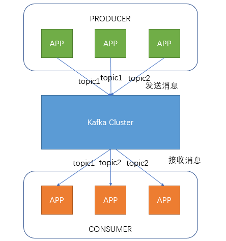
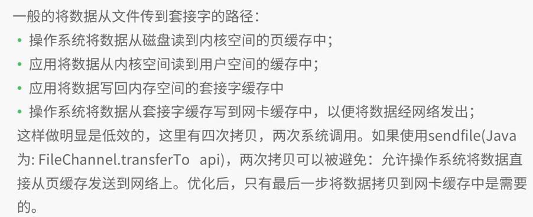
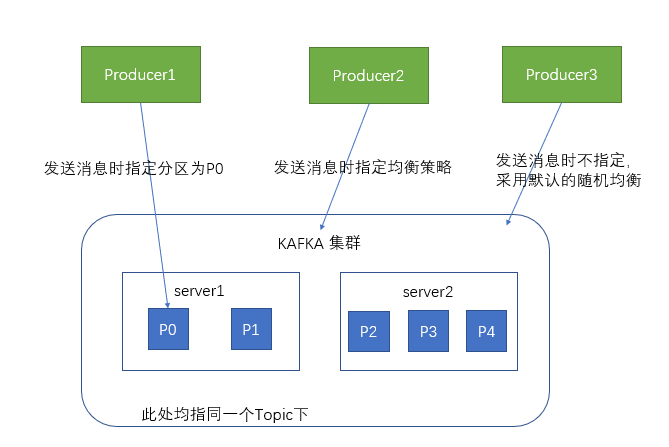
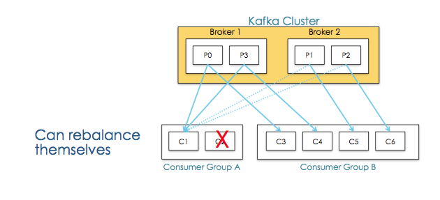
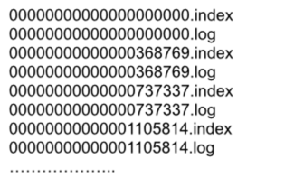

##kafka

####运用
- 分布式消息传递
- 网站活跃数据跟踪
- 日志聚合
- 流式数据处理
- 数据存储
- 事件源

####概念Concepts
2.0版本以前，kafka官方定义是一种发布订阅消息系统。  
2.0版本以后，kafka官方定义是一种流式处理框架。  Kafka is used for building real-time data pipelines and streaming apps。
流式处理框架有三个关键能力：  
发布和订阅消息（流），在这方面，它类似于一个消息队列或企业消息系统。  
以容错的方式存储消息（流）。  
在消息流发生时处理它们。  

####kafka使用的协议AMQP(dvanced Message Queuing Protoco，高级消息队列协议)
- Producer即生产者，向Kafka集群发送消息，在发送消息之前，会对消息进行分类，即Topic，上图展示了两个producer发送了分类为topic1的消息，另外一个发送了topic2的消息。
- Topic即主题，通过对消息指定主题可以将消息分类，消费者可以只关注自己需要的Topic中的消息
- Consumer即消费者，消费者通过与kafka集群建立长连接的方式，不断地从集群中拉取消息，然后可以对这些消息进行处理。

从上图中就可以看出同一个Topic下的消费者和生产者的数量并不是对应的。

####zero copy


##kafka core

####kafka服务器消息存储策略

谈到kafka的存储，就不得不提到分区，即partitions，创建一个topic时，同时可以指定分区数目，分区数越多，其吞吐量也越大，但是需要的资源也越多，同时也会导致更高的不可用性。
kafka在接收到生产者发送的消息之后，会根据均衡策略将消息存储到不同的分区中。

在每个分区中，消息以顺序存储，最晚接收的的消息会最后被消费。

即使消息被消费，消息仍然不会被立即删除。日志文件将会根据broker中的配置要求，保留一定的时间之后删除；比如log文件保留2天，那么两天后，
文件会被清除，无论其中的消息是否被消费。kafka通过这种简单的手段，来释放磁盘空间，以及减少消息消费之后对文件内容改动的磁盘IO开支。

partitions的设计目的有多个，最根本原因是kafka基于文件存储。
通过分区，可以将日志内容分散到多个server上,来避免文件尺寸达到单机磁盘的上限，每个partiton都会被当前server(kafka实例)保存；
可以将一个topic切分多任意多个partitions，来消息保存/消费的效率。此外越多的partitions意味着可以容纳更多的consumer，有效提升并发消费的能力。

一个Topic的多个partitions,被分布在kafka集群中的多个server上;每个server(kafka实例)负责partitions中消息的读写操作;此外kafka还可以配置partitions需要备份的个数(replicas),每个partition将会被备份到多台机器上,以提高可用性。
 
基于replication方案,那么就意味着需要对多个备份进行调度;每个partition都有一个server为"leader";leader负责所有的读写操作,如果leader失效,那么将会有其他follower来接管(成为新的leader);
follower只是单调的和leader跟进,同步消息即可..由此可见作为leader的server承载了全部的请求压力,因此从集群的整体考虑,有多少个partitions就意味着有多少个"leader",kafka会将"leader"均衡的分散在每个实例上,来确保整体的性能稳定。

####与生产者的交互

生产者在向kafka集群发送消息的时候，可以通过指定分区来发送到指定的分区中
也可以通过指定均衡策略来将消息发送到不同的分区中
如果不指定，就会采用默认的随机均衡策略，将消息随机的存储到不同的分区中

####与消费者的交互

在消费者消费消息时，kafka使用offset来记录当前消费的位置
在kafka的设计中，可以有多个不同的group来同时消费同一个topic下的消息，如图，我们有两个不同的group同时消费，他们的的消费的记录位置offset各不相同，不互相干扰。
对于一个group而言，消费者的数量不应该多余分区的数量，因为在一个group中，每个分区至多只能绑定到一个消费者上，即一个消费者可以消费多个分区，一个分区只能给一个消费者消费
因此，若一个group中的消费者数量大于分区数量的话，多余的消费者将不会收到任何消息。

对于consumer而言,它需要保存消费消息的offset,对于offset的保存和使用,有consumer来控制;当consumer正常消费消息时,offset将会"线性"的向前驱动,即消息将依次顺序被消费。
事实上consumer可以使用任意顺序消费消息,它只需要将offset重置为任意值。

kafka集群几乎不需要维护任何consumer和producer状态信息,这些信息有zookeeper保存;因此producer和consumer的客户端实现非常轻量级,它们可以随意离开,而不会对集群造成额外的影响.


当某个Consumer挂掉后能够重新平衡：
- 点对点，将所有消费者放到一个Consumer Group
- 广播，将每个消费者单独放到一个Consumer Group
- 水平扩展，向Consumer Group中添加消费者并进行Rebalance
- 故障转移，当某个Consumer发生故障时,Consumer Group重新分配分区

####复制备份
kafka将每个partition数据复制到多个server上,任何一个partition有一个leader和多个follower(可以没有);
备份的个数可以通过broker配置文件来设定，leader处理所有的read-write请求,follower需要和leader保持同步。
Follower和consumer一样,消费消息并保存在本地日志中;leader负责跟踪所有的follower状态,如果follower"落后"太多或者失效,leader将会把它从replicas同步列表中删除。
当所有的follower都将一条消息保存成功,此消息才被认为是"committed",那么此时consumer才能消费它。
即使只有一个replicas实例存活,仍然可以保证消息的正常发送和接收,只要zookeeper集群存活即可.(不同于其他分布式存储,比如hbase需要"多数派"存活才行)
当leader失效时,需在followers中选取出新的leader,可能此时follower落后于leader,因此需要选择一个"up-to-date"的follower.
选择follower时需要兼顾一个问题,就是新leader server上所已经承载的partition leader的个数,如果一个server上有过多的partition leader,意味着此server将承受着更多的IO压力.在选举新leader,需要考虑到"负载均衡".

####kafka在磁盘中的存储
其中.index索引文件存储大量元数据，.log数据文件存储大量消息，索引文件中元数据指向对应数据文件中message的物理偏移地址。他们两个是一一对应的,对应关系如下 


index中分为两个字段（3，497）代表第三条消息的偏移量为497

####kafka在zookeeper的存储目录
- topic注册信息，/brokers/topics/[topic]
```
存储某个topic的partitions所有分配信息

Schema:
{
    "version": "版本编号目前固定为数字1",
    "partitions": {
        "partitionId编号": [
            同步副本组brokerId列表
        ],
        "partitionId编号": [
            同步副本组brokerId列表
        ],
        .......
    }
}
Example:
{
    "version": 1,
    "partitions": {
    "0":[0,1,2]
     }
}
``` 

- partition状态信息，/brokers/topics/[topic]/partitions/[0...N]，其中[0..N]表示partition索引号
```
Schema:
{
    "controller_epoch": 表示kafka集群中的中央控制器选举次数,
    "leader": 表示该partition选举leader的brokerId,
    "version": 版本编号默认为1,
    "leader_epoch": 该partition leader选举次数,
    "isr": [同步副本组brokerId列表]
}
  
Example:
{
    "controller_epoch":20,
    "leader":0,
    "version":1,
    "leader_epoch":0,
    "isr":[0,1,2]
}
```

- broker注册信息，/brokers/ids/[0...N]
```
每个broker的配置文件中都需要指定一个数字类型的id(全局不可重复),此节点为临时znode(EPHEMERAL)

Schema:
{
    "jmx_port": jmx端口号,
    "timestamp": kafka broker初始启动时的时间戳,
    "host": 主机名或ip地址,
    "version": 版本编号默认为1,
    "port": kafka broker的服务端端口号,由server.properties中参数port确定
}
  
Example:
{
    "jmx_port":1,
    "timestamp":"1452068227537",
    "host":"h1",
    "version":1,
    "port":9092
}
```

- controller epoch，/controller_epoch -> int (epoch)
```
epoch  [ˈi:pɒk] n. 时期;纪元;世;新时代
Kafka的心脏是控制器。
在Kafka集群中会有一个或者多个broker，其中有一个broker会被选举为控制器（Kafka Controller），它负责管理整个集群中所有分区和副本的状态。
当某个分区的leader副本出现故障时，由控制器负责为该分区选举新的leader副本。当检测到某个分区的ISR集合发生变化时，由控制器负责通知所有broker更新其元数据信息。
当使用kafka-topics.sh脚本为某个topic增加分区数量时，同样还是由控制器负责分区的重新分配。

这个节点是持久（PERSISTENT）节点，此值为一个数字,kafka集群中第一个broker第一次启动时为1。
以后只要集群中center controller中央控制器所在broker变更或挂掉，就会重新选举新的center controller，每次center controller变更controller_epoch值就会 + 1; 
```

- controller注册信息，/controller -> int (broker id of the controller)
```
存储center controller中央控制器所在kafka broker的信息

Schema:
{
    "version": 版本编号默认为1,
    "brokerid": kafka集群中broker唯一编号,
    "timestamp": kafka broker中央控制器变更时的时间戳
}
  
Example:
{
    "version":1,
    "brokerid":0,
    "timestamp":"1452068227409"
}
```

- consumer注册信息，/consumers/[groupId]/ids/[consumerIdString]
```
每个consumer都有一个唯一的ID(consumerId可以通过配置文件指定,也可以由系统生成),此id用来标记消费者信息.
是一个临时的znode,此节点的值为请看consumerIdString产生规则,即表示此consumer目前所消费的topic + partitions列表. 
Schema:
{
    "version": 版本编号默认为1,
    "subscription": { //订阅topic列表
        "topic名称": consumer中topic消费者线程数
    },
    "pattern": "static",
    "timestamp": "consumer启动时的时间戳"
}
  
Example:
{
    "version":1,
    "subscription":{
        "replicatedtopic":1
    },
    "pattern":"white_list",
    "timestamp":"1452134230082"
}
```

- consumer owner，/consumers/[groupId]/owners/[topic]/[partitionId] -> consumerIdString + threadId索引编号
```
当consumer启动时,所触发的操作:
a) 首先进行"Consumer Id注册";
b) 然后在"Consumer id 注册"节点下注册一个watch用来监听当前group中其他consumer的"退出"和"加入";只要此znode path下节点列表变更,
   都会触发此group下consumer的负载均衡.(比如一个consumer失效,那么其他consumer接管partitions).
c) 在"Broker id 注册"节点下,注册一个watch用来监听broker的存活情况;如果broker列表变更,将会触发所有的groups下的consumer重新balance.
```

- consumer offset，/consumers/[groupId]/offsets/[topic]/[partitionId] -> long (offset)
```
用来跟踪每个consumer目前所消费的partition中最大的offset
此znode为持久节点,可以看出offset跟group_id有关,以表明当消费者组(consumer group)中一个消费者失效,
重新触发balance,其他consumer可以继续消费. 
```
