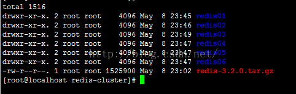
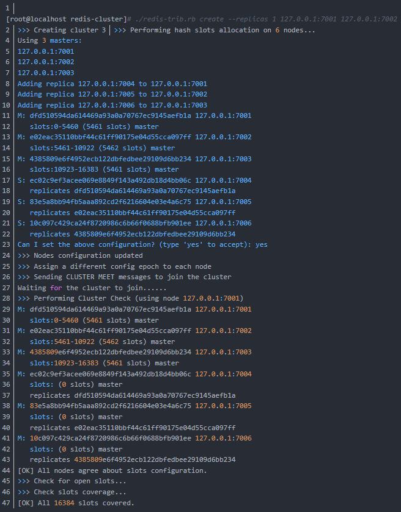

###redis集群的搭建
集群中至少应该有奇数个节点，所以至少有三个节点，每个节点至少有一个备份节点，所以下面使用6节点（主节点、备份节点由redis-cluster集群确定）。

#####1. 安装redis节点指定端口
1. 安装的前提条件，需要安装gcc
```
yum install gcc-c++
```
2. 1、下载redis的源码包，把源码包上传到linux服务器，解压redis压缩包，编译安装
```
    tar xzf redis-3.2.0.tar.gz
    cd redis-3.2.0
    make
    make install PREFIX=/usr/andy/redis-cluster
```

3. 在redis-cluster下 修改bin文件夹为redis01,复制redis.conf配置文件，配置redis的配置文件redis.conf
```
daemonize yes               #后台启动
port 7001                   #修改端口号，从7001到7006
cluster-enabled yes         #如果是yes，表示启用集群，否则以单例模式启动
cluster-config-file nodes.conf
cluster-node-timeout 15000  #超时时间，集群节点不可用的最大时间
appendonly yes
```

4. 复制六份，修改对应的端口号


5. 启动方式
```
前台启动模式：
    /usr/local/redis/bin/redis-server
    默认是前端启动模式，端口是6379
    
后台启动
1）从redis的源码目录中复制redis.conf到redis的安装目录。
2）修改配置文件：daemonize yes
3）./redis-server redis.conf
```

#####2. 安装redis-trib所需的 ruby脚本
```
1.复制redis解压文件src下的redis-trib.rb文件到redis-cluster目录
    [root@localhost redis-cluster]# cp /usr/andy/redis/redis-3.2.0/src/redis-trib.rb ./
    
2.安装ruby环境：
    [root@localhost redis-cluster]# yum install ruby
    [root@localhost redis-cluster]# yum install rubygems
    
3.安装redis-trib.rb运行依赖的ruby的包redis-3.2.2.gem，这个包需要上传到linux服务
    [root@localhost redis-cluster]# gem install redis-3.2.2.gem
```

#####3. 启动脚本，设置权限启动，启动所有的redis节点
```
写一个命令脚本start-all.sh

cd redis01
./redis-server redis.conf
cd ..
cd redis02
./redis-server redis.conf
cd ..
cd redis03
./redis-server redis.conf
cd ..
cd redis04
./redis-server redis.conf
cd ..
cd redis05
./redis-server redis.conf
cd ..
cd redis06
./redis-server redis.conf
cd ..


[root@localhost redis-cluster]# chmod 777 start-all.sh 
[root@localhost redis-cluster]# ./start-all.sh 

查看redis进程启动状态
[root@localhost redis-cluster]# ps -ef | grep redis
 
root       4547      1  0 23:12 ?        00:00:00 ./redis-server 127.0.0.1:7001 [cluster]
root       4551      1  0 23:12 ?        00:00:00 ./redis-server 127.0.0.1:7002 [cluster]
root       4555      1  0 23:12 ?        00:00:00 ./redis-server 127.0.0.1:7003 [cluster]
root       4559      1  0 23:12 ?        00:00:00 ./redis-server 127.0.0.1:7004 [cluster]
root       4563      1  0 23:12 ?        00:00:00 ./redis-server 127.0.0.1:7005 [cluster]
root       4567      1  0 23:12 ?        00:00:00 ./redis-server 127.0.0.1:7006 [cluster]
root       4840   4421  0 23:26 pts/1    00:00:00 grep --color=auto redis

可以看到redis的6个节点已经启动成功，杀死全部的几点：
[root@localhost redis-cluster]# pkill -9 redis


```

#####4. 使用redis-trib.rb创建集群
- 使用create命令 --replicas 1 参数表示为每个主节点创建一个从节点，其他参数是实例的地址集合。

```
./redis-trib.rb create --replicas 1 127.0.0.1:7001 127.0.0.1:7002 127.0.0.1:7003 127.0.0.1:7004 127.0.0.1:7005 127.0.0.1:7006
```


```
有3个主节点，3个从节点，每个节点都是成功连接状态。

3个主节点[M]以及分配的哈希卡槽如下：

  M: dfd510594da614469a93a0a70767ec9145aefb1a 127.0.0.1:7001
       slots:0-5460 (5461 slots) master
  M: e02eac35110bbf44c61ff90175e04d55cca097ff 127.0.0.1:7002
       slots:5461-10922 (5462 slots) master
  M: 4385809e6f4952ecb122dbfedbee29109d6bb234 127.0.0.1:7003
       slots:10923-16383 (5461 slots) master

3个从节点[S]以及附属的主节点如下：

  S: ec02c9ef3acee069e8849f143a492db18d4bb06c 127.0.0.1:7004
       replicates dfd510594da614469a93a0a70767ec9145aefb1a
  S: 83e5a8bb94fb5aaa892cd2f6216604e03e4a6c75 127.0.0.1:7005
       replicates e02eac35110bbf44c61ff90175e04d55cca097ff
  S: 10c097c429ca24f8720986c6b66f0688bfb901ee 127.0.0.1:7006
       replicates 4385809e6f4952ecb122dbfedbee29109d6bb234

以上集群安装成功了，如果安装未成功报如下错误
   >>> Creating cluster
   [ERR] Sorry, can't connect to node  ....
   
需要安装最新的ruby源码
[root@localhost redis-cluster]# tar -zxvf ruby-2.3.1.tar.gz 
[root@localhost redis-cluster]# cd  
[root@localhost redis-cluster]# ./configure --prefix=/usr/local/ruby-2.3.1  
[root@localhost redis-cluster]# make && make install     
[root@localhost redis-cluster]#gem install redis
```

#####5. redis客户端
```
单机连接
./redis-cli -h localhost -p 7001
单机关闭
./redis-cli -p 7001 shutdown
```

```
集群连接
./redis-cli -c -p 7001
集群关闭，见redis.md
```
