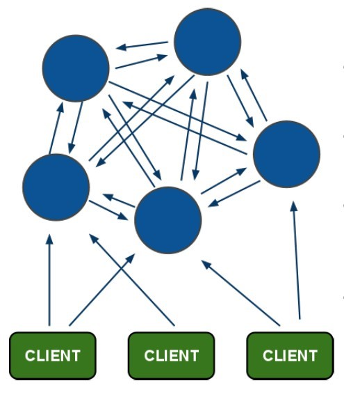

###一、redis-cluster设计
Redis集群搭建的方式有多种，例如使用zookeeper等，但从redis 3.0之后版本支持redis-cluster集群，Redis-Cluster采用无中心结构，
每个节点保存数据和整个集群状态,每个节点都和其他所有节点连接。其redis-cluster架构图如下：



```
其结构特点：
    1、所有的redis节点彼此互联(PING-PONG机制),内部使用二进制协议优化传输速度和带宽。
    2、节点的fail是通过集群中超过半数的节点检测失效时才生效。
    3、客户端与redis节点直连,不需要中间proxy层.客户端不需要连接集群所有节点,连接集群中任何一个可用节点即可。
    4、redis-cluster把所有的物理节点映射到[0-16383]slot上（不一定是平均分配）,cluster 负责维护node<->slot<->value。
    5、Redis集群预分好16384个桶，当需要在 Redis 集群中放置一个 key-value 时，根据 CRC16(key) mod 16384的值，决定将一个key放到哪个桶中。
```

#####1.redis cluster节点分配
```
现在我们是三个主节点分别是：A, B, C 三个节点，它们可以是一台机器上的三个端口，也可以是三台不同的服务器。
那么，采用哈希槽 (hash slot)的方式来分配16384个slot 的话，它们三个节点分别承担的slot 区间是：

    节点A覆盖0－5460;
    节点B覆盖5461－10922;
    节点C覆盖10923－16383.
    
获取数据：
    如果存入一个值，按照redis cluster哈希槽的算法： CRC16('key')%16384 = 6782。 那么就会把这个key 的存储分配到 B 上了。
    同样，当我连接(A,B,C)任何一个节点想获取'key'这个key时，也会这样的算法，然后内部跳转到B节点上获取数据 

新增一个主节点：
    新增一个节点D，redis cluster的这种做法是从各个节点的前面各拿取一部分slot到D上，我会在接下来的实践中实验。大致就会变成这样：

    节点A覆盖1365-5460
    节点B覆盖6827-10922
    节点C覆盖12288-16383
    节点D覆盖0-1364,5461-6826,10923-12287

同样删除一个节点也是类似，移动完成后就可以删除这个节点了。
```

#####2、Redis Cluster主从模式
```
redis cluster 为了保证数据的高可用性，加入了主从模式，一个主节点对应一个或多个从节点，主节点提供数据存取，从节点则是从主节点拉取数据备份，
当这个主节点挂掉后，就会有这个从节点选取一个来充当主节点，从而保证集群不会挂掉。

上面那个例子里, 集群有ABC三个主节点, 如果这3个节点都没有加入从节点，如果B挂掉了，我们就无法访问整个集群了。A和C的slot也无法访问。
所以我们在集群建立的时候，一定要为每个主节点都添加了从节点, 比如像这样, 集群包含主节点A、B、C, 以及从节点A1、B1、C1, 那么即使B挂掉系统也可以继续正确工作。
B1节点替代了B节点，所以Redis集群将会选择B1节点作为新的主节点，集群将会继续正确地提供服务。 当B重新开启后，它就会变成B1的从节点。

不过需要注意，如果节点B和B1同时挂了，Redis集群就无法继续正确地提供服务了。
```

- Redis Cluster主从模式不能保证不能保证强一致性
```
写可能是这样发生的：

    客户端写到master B
    master B回复客户端OK
    master B将这个写操作广播给它的slaves B1、B2、B3
正如你看到的那样，B没有等到B1、B2、B3确认就回复客户端了，也就是说，B在回复客户端之前没有等待B1、B2、B3的确认，
这对应Redis来说是一个潜在的风险。所以，如果客户端写了一些东西，B也确认了这个写操作，但是在它将这个写操作发给它的slaves之前它宕机了，
随后其中一个slave（没有收到这个写命令）可能被提升为新的master，于是这个写操作就永远丢失了。
```
```
Redis集群将会丢失写操作，这发生在一个网络分区中，在这个分区中，客户端与少数实例(包括至少一个主机)隔离。
假设这样一个例子，有一个集群有6个节点，分别由A、B、C、A1、B1、C1组成，三个masters三个slaves，有一个客户端我们叫Z1。在分区发生以后，
可能分区的一边是A、C、A1、B1、C1，另一边有B和Z1。此时，Z1仍然可用写数据到B，如果网络分区的时间很短，那么集群可能继续正常工作，
而如果分区的时间足够长以至于B1在多的那一边被提升为master，那么这个时候Z1写到B上的数据就会丢失。通过node timeout设置丢失的最长时间。
在超过node timeout以后，一个master节点被认为已经失败了，并且选择它的一个副本接替master。
类似地，如果在过了node timeout时间以后，没有一个master能够和其它大多数的master通信，那么整个集群都将停止接受写操作。
```


###二、redis集群的测试

#####1、测试存取值
- 客户端连接集群redis-cli需要带上 -c ，redis-cli -c -p 端口号
```
[root@localhost redis01]# ./redis-cli -c -p 7001
127.0.0.1:7001> set name andy
-> Redirected to slot [5798] located at 127.0.0.1:7002
OK
127.0.0.1:7002> get name
"andy"
127.0.0.1:7002> 
```
- 根据redis-cluster的key值分配，name应该分配到节点7002[5461-10922]上，上面显示redis cluster自动从7001跳转到了7002节点。
我们可以测试一下7006从节点获取name值
```
[root@localhost redis06]# ./redis-cli -c -p 7006
127.0.0.1:7006> get name
-> Redirected to slot [5798] located at 127.0.0.1:7002
"andy"
127.0.0.1:7002> 
```
7006位7003的从节点，从上面也是自动跳转至7002获取值，这也是redis cluster的特点，它是去中心化，每个节点都是对等的，连接哪个节点都可以获取和设置数据。

#####2、常用的数据类型
```
String
Hash
List
Set
SortedSet
```


###三、集群节点选举

#####1、选举
- 现在模拟将7002节点挂掉，按照redis-cluster原理会选举会将 7002的从节点7005选举为主节点。
```
[root@localhost redis-cluster]# ps -ef | grep redis
root       7950      1  0 12:50 ?        00:00:28 ./redis-server 127.0.0.1:7001 [cluster]
root       7952      1  0 12:50 ?        00:00:29 ./redis-server 127.0.0.1:7002 [cluster]
root       7956      1  0 12:50 ?        00:00:29 ./redis-server 127.0.0.1:7003 [cluster]
root       7960      1  0 12:50 ?        00:00:29 ./redis-server 127.0.0.1:7004 [cluster]
root       7964      1  0 12:50 ?        00:00:29 ./redis-server 127.0.0.1:7005 [cluster]
root       7966      1  0 12:50 ?        00:00:29 ./redis-server 127.0.0.1:7006 [cluster]
root      11346  10581  0 14:57 pts/2    00:00:00 grep --color=auto redis
[root@localhost redis-cluster]# kill 7952
```

- 在查看集群中的7002节点
```

[root@localhost redis-cluster]# 
[root@localhost redis-cluster]# ./redis-trib.rb check 127.0.0.1:7002
[ERR] Sorry, can't connect to node 127.0.0.1:7002
[root@localhost redis-cluster]# ./redis-trib.rb check 127.0.0.1:7005
>>> Performing Cluster Check (using node 127.0.0.1:7005)
M: a5db243087d8bd423b9285fa8513eddee9bb59a6 127.0.0.1:7005
   slots:5461-10922 (5462 slots) master
   0 additional replica(s)
S: 50ce1ea59106b4c2c6bc502593a6a7a7dabf5041 127.0.0.1:7004
   slots: (0 slots) slave
   replicates dd19221c404fb2fc4da37229de56bab755c76f2b
M: f9886c71e98a53270f7fda961e1c5f730382d48f 127.0.0.1:7003
   slots:10923-16383 (5461 slots) master
   1 additional replica(s)
M: dd19221c404fb2fc4da37229de56bab755c76f2b 127.0.0.1:7001
   slots:0-5460 (5461 slots) master
   1 additional replica(s)
S: 8bb3ede48319b46d0015440a91ab277da9353c8b 127.0.0.1:7006
   slots: (0 slots) slave
   replicates f9886c71e98a53270f7fda961e1c5f730382d48f
[OK] All nodes agree about slots configuration.
>>> Check for open slots...
>>> Check slots coverage...
[OK] All 16384 slots covered.
[root@localhost redis-cluster]# 
```
-  可以看到集群连接不了7002节点，而7005有原来的S转换为M节点，代替了原来的7002节点。
我们可以获取name值：从7001节点连入，自动跳转到7005节点，并且获取name值。
```
[root@localhost redis01]# ./redis-cli -c -p 7001
127.0.0.1:7001> get name
-> Redirected to slot [5798] located at 127.0.0.1:7005
"andy"
127.0.0.1:7005> 
127.0.0.1:7005> 
```

- 现在我们将7002节点恢复，看是否会自动加入集群中以及充当的M还是S节点。再check一下7002节点
可以看到7002节点变成了a5db243087d8bd423b9285fa8513eddee9bb59a6 7005的从节点。

```
[root@localhost redis-cluster]# cd redis02
[root@localhost redis02]# ./redis-server redis.conf 
[root@localhost redis02]#

[root@localhost redis-cluster]# ./redis-trib.rb check 127.0.0.1:7002
>>> Performing Cluster Check (using node 127.0.0.1:7002)
S: 1f07d76585bfab35f91ec711ac53ab4bc00f2d3a 127.0.0.1:7002
   slots: (0 slots) slave
   replicates a5db243087d8bd423b9285fa8513eddee9bb59a6
M: f9886c71e98a53270f7fda961e1c5f730382d48f 127.0.0.1:7003
   slots:10923-16383 (5461 slots) master
   1 additional replica(s)
M: a5db243087d8bd423b9285fa8513eddee9bb59a6 127.0.0.1:7005
   slots:5461-10922 (5462 slots) master
   1 additional replica(s)
S: 50ce1ea59106b4c2c6bc502593a6a7a7dabf5041 127.0.0.1:7004
   slots: (0 slots) slave
   replicates dd19221c404fb2fc4da37229de56bab755c76f2b
S: 8bb3ede48319b46d0015440a91ab277da9353c8b 127.0.0.1:7006
   slots: (0 slots) slave
   replicates f9886c71e98a53270f7fda961e1c5f730382d48f
M: dd19221c404fb2fc4da37229de56bab755c76f2b 127.0.0.1:7001
   slots:0-5460 (5461 slots) master
   1 additional replica(s)
[OK] All nodes agree about slots configuration.
>>> Check for open slots...
>>> Check slots coverage...
[OK] All 16384 slots covered.
[root@localhost redis-cluster]#
```

#####2、投票容错
```
1) 领着投票过程是集群中所有master参与,如果半数以上master节点与master节点通信超过(cluster-node-timeout),认为当前master节点挂掉.
2) 什么时候整个集群不可用(cluster_state:fail)? 
    a:如果集群任意master挂掉,且当前master没有slave.集群进入fail状态,也可以理解成集群的slot映射[0-16383]不完成时进入fail状态. 
ps: redis-3.0.0.rc1加入cluster-require-full-coverage参数,默认关闭,打开集群兼容部分失败.
    b:如果集群超过半数以上master挂掉，无论是否有slave集群进入fail状态.
ps:当集群不可用时,所有对集群的操作做都不可用，收到((error) CLUSTERDOWN The cluster is down)错误
```

###四、集群节点添加
节点新增包括新增主节点、从节点两种情况。以下分别做一下测试：

#####1、新增主节点
- 新增一个节点7007作为主节点修改配置文件，启动7007redis服务
```
[root@localhost redis-cluster]# cp -r  redis01 redis07
[root@localhost redis-cluster]# cd redis07/
[root@localhost redis07]# sed -i "s/7001/7007/g" ./redis.conf 


[root@localhost redis07]# ./redis-server redis.conf 
[root@localhost redis07]# netstat -anp | grep 7007
tcp        0      0 127.0.0.1:17007         0.0.0.0:*               LISTEN      13441/./redis-serve 
tcp        0      0 127.0.0.1:7007          0.0.0.0:*               LISTEN      13441/./redis-serve 
[root@localhost redis07]# 
```

- 上面可以看到，7007已经启动，现在加入集群中。添加使用redis-trib.rb的add-node命令。
add-node是加入集群节点，127.0.0.1:7007为要加入的节点，127.0.0.1:7002 表示加入的集群的一个节点，用来辨识是哪个集群，理论上那个集群的节点都可以。
```
[root@localhost redis-cluster]# ./redis-trib.rb add-node 127.0.0.1:7007 127.0.0.1:7002
>>> Adding node 127.0.0.1:7007 to cluster 127.0.0.1:7002
>>> Performing Cluster Check (using node 127.0.0.1:7002)
S: 1f07d76585bfab35f91ec711ac53ab4bc00f2d3a 127.0.0.1:7002
   slots: (0 slots) slave
   replicates a5db243087d8bd423b9285fa8513eddee9bb59a6
M: f9886c71e98a53270f7fda961e1c5f730382d48f 127.0.0.1:7003
   slots:10923-16383 (5461 slots) master
   1 additional replica(s)
M: a5db243087d8bd423b9285fa8513eddee9bb59a6 127.0.0.1:7005
   slots:5461-10922 (5462 slots) master
   1 additional replica(s)
S: 50ce1ea59106b4c2c6bc502593a6a7a7dabf5041 127.0.0.1:7004
   slots: (0 slots) slave
   replicates dd19221c404fb2fc4da37229de56bab755c76f2b
S: 8bb3ede48319b46d0015440a91ab277da9353c8b 127.0.0.1:7006
   slots: (0 slots) slave
   replicates f9886c71e98a53270f7fda961e1c5f730382d48f
M: dd19221c404fb2fc4da37229de56bab755c76f2b 127.0.0.1:7001
   slots:0-5460 (5461 slots) master
   1 additional replica(s)
[OK] All nodes agree about slots configuration.
>>> Check for open slots...
>>> Check slots coverage...
[OK] All 16384 slots covered.
>>> Send CLUSTER MEET to node 127.0.0.1:7007 to make it join the cluster.
[OK] New node added correctly.
[root@localhost redis-cluster]# 
```

- 可以看到7007加入这个Cluster，并成为一个新的节点。check7007节点状态
```
[root@localhost redis-cluster]# ./redis-trib.rb check 127.0.0.1:7007
>>> Performing Cluster Check (using node 127.0.0.1:7007)
M: ee3efb90e5ac0725f15238a64fc60a18a71205d7 127.0.0.1:7007
   slots: (0 slots) master
   0 additional replica(s)
S: 8bb3ede48319b46d0015440a91ab277da9353c8b 127.0.0.1:7006
   slots: (0 slots) slave
   replicates f9886c71e98a53270f7fda961e1c5f730382d48f
M: dd19221c404fb2fc4da37229de56bab755c76f2b 127.0.0.1:7001
   slots:0-5460 (5461 slots) master
   1 additional replica(s)
M: f9886c71e98a53270f7fda961e1c5f730382d48f 127.0.0.1:7003
   slots:10923-16383 (5461 slots) master
   1 additional replica(s)
S: 1f07d76585bfab35f91ec711ac53ab4bc00f2d3a 127.0.0.1:7002
   slots: (0 slots) slave
   replicates a5db243087d8bd423b9285fa8513eddee9bb59a6
M: a5db243087d8bd423b9285fa8513eddee9bb59a6 127.0.0.1:7005
   slots:5461-10922 (5462 slots) master
   1 additional replica(s)
S: 50ce1ea59106b4c2c6bc502593a6a7a7dabf5041 127.0.0.1:7004
   slots: (0 slots) slave
   replicates dd19221c404fb2fc4da37229de56bab755c76f2b
[OK] All nodes agree about slots configuration.
>>> Check for open slots...
>>> Check slots coverage...
[OK] All 16384 slots covered.
[root@localhost redis-cluster]# 
```

-   redis-cluster在新增节点时并未分配卡槽，需要我们手动对集群进行重新分片迁移数据，需要重新分片命令reshard
这个命令是用来迁移slot节点的，后面的127.0.0.1:7005是表示是哪个集群，端口填［7000-7007］都可以，执行结果如下：
```
[root@localhost redis-cluster]# ./redis-trib.rb reshard 127.0.0.1:7005
>>> Performing Cluster Check (using node 127.0.0.1:7005)
M: a5db243087d8bd423b9285fa8513eddee9bb59a6 127.0.0.1:7005
   slots:5461-10922 (5462 slots) master
   1 additional replica(s)
S: 50ce1ea59106b4c2c6bc502593a6a7a7dabf5041 127.0.0.1:7004
   slots: (0 slots) slave
   replicates dd19221c404fb2fc4da37229de56bab755c76f2b
M: f9886c71e98a53270f7fda961e1c5f730382d48f 127.0.0.1:7003
   slots:10923-16383 (5461 slots) master
   1 additional replica(s)
S: 1f07d76585bfab35f91ec711ac53ab4bc00f2d3a 127.0.0.1:7002
   slots: (0 slots) slave
   replicates a5db243087d8bd423b9285fa8513eddee9bb59a6
M: ee3efb90e5ac0725f15238a64fc60a18a71205d7 127.0.0.1:7007
   slots: (0 slots) master
   0 additional replica(s)
M: dd19221c404fb2fc4da37229de56bab755c76f2b 127.0.0.1:7001
   slots:0-5460 (5461 slots) master
   1 additional replica(s)
S: 8bb3ede48319b46d0015440a91ab277da9353c8b 127.0.0.1:7006
   slots: (0 slots) slave
   replicates f9886c71e98a53270f7fda961e1c5f730382d48f
[OK] All nodes agree about slots configuration.
>>> Check for open slots...
>>> Check slots coverage...
[OK] All 16384 slots covered.
How many slots do you want to move (from 1 to 16384)? 
```

- 它提示我们需要迁移多少slot到7007上，我们平分16384个哈希槽给4个节点：16384/4 = 4096，我们需要移动4096个槽点到7007上。
redis-trib 会向你询问重新分片的源节点（source node），即，要从特点的哪个节点中取出 4096 个哈希槽，还是从全部节点提取4096个哈希槽， 并将这些槽移动到7007节点上面。
如果我们不打算从特定的节点上取出指定数量的哈希槽，那么可以向redis-trib输入 all，这样的话， 集群中的所有主节点都会成为源节点，redis-trib从各个源节点中各取出一部分哈希槽，凑够4096个，然后移动到7007节点上：
```
[OK] All 16384 slots covered.
How many slots do you want to move (from 1 to 16384)? 4096
What is the receiving node ID? 


Source node #1:all
```

- redis-trib就开始执行分片操作，将哈希槽一个一个从源主节点移动到7007目标主节点。
重新分片结束后我们可以check以下节点的分配情况
```
[root@localhost redis-cluster]# ./redis-trib.rb check 127.0.0.1:7001
>>> Performing Cluster Check (using node 127.0.0.1:7001)
M: dd19221c404fb2fc4da37229de56bab755c76f2b 127.0.0.1:7001
   slots:1365-5460 (4096 slots) master
   1 additional replica(s)
M: ee3efb90e5ac0725f15238a64fc60a18a71205d7 127.0.0.1:7007
   slots:0-1364,5461-6826,10923-12287 (4096 slots) master
   0 additional replica(s)
M: a5db243087d8bd423b9285fa8513eddee9bb59a6 127.0.0.1:7005
   slots:6827-10922 (4096 slots) master
   1 additional replica(s)
S: 8bb3ede48319b46d0015440a91ab277da9353c8b 127.0.0.1:7006
   slots: (0 slots) slave
   replicates f9886c71e98a53270f7fda961e1c5f730382d48f
M: f9886c71e98a53270f7fda961e1c5f730382d48f 127.0.0.1:7003
   slots:12288-16383 (4096 slots) master
   1 additional replica(s)
S: 1f07d76585bfab35f91ec711ac53ab4bc00f2d3a 127.0.0.1:7002
   slots: (0 slots) slave
   replicates a5db243087d8bd423b9285fa8513eddee9bb59a6
S: 50ce1ea59106b4c2c6bc502593a6a7a7dabf5041 127.0.0.1:7004
   slots: (0 slots) slave
   replicates dd19221c404fb2fc4da37229de56bab755c76f2b
[OK] All nodes agree about slots configuration.
>>> Check for open slots...
>>> Check slots coverage...
[OK] All 16384 slots covered.
[root@localhost redis-cluster]# 

```

#####2、新增从节点
-  新增一个节点7008节点，使用add-node --slave命令。
nodeid为要加到master主节点的node id，127.0.0.1:7008为新增的从节点，127.0.0.1:7000为集群的一个节点（集群的任意节点都行），用来辨识是哪个集群；
如果没有给定那个主节点--master-id的话，redis-trib将会将新增的从节点随机到从节点较少的主节点上。
现在我们添加一下7008，看是否会自动加到没有从节点的7007主节点上。
```
[root@localhost redis-cluster]# cp -r redis01/ redis08
[root@localhost redis-cluster]# cd redis08/
[root@localhost redis08]# sed -i "s/7001/7008/g" ./redis.conf
[root@localhost redis08]# ./redis-server redis.conf 


[root@localhost redis-cluster]# ./redis-trib.rb add-node --slave 127.0.0.1:7008 127.0.0.1:7001>>> Adding node 127.0.0.1:7008 to cluster 127.0.0.1:7001
>>> Performing Cluster Check (using node 127.0.0.1:7001)
M: dd19221c404fb2fc4da37229de56bab755c76f2b 127.0.0.1:7001
   slots:1365-5460 (4096 slots) master
   1 additional replica(s)
M: ee3efb90e5ac0725f15238a64fc60a18a71205d7 127.0.0.1:7007
   slots:0-1364,5461-6826,10923-12287 (4096 slots) master
   0 additional replica(s)
M: a5db243087d8bd423b9285fa8513eddee9bb59a6 127.0.0.1:7005
   slots:6827-10922 (4096 slots) master
   1 additional replica(s)
S: 8bb3ede48319b46d0015440a91ab277da9353c8b 127.0.0.1:7006
   slots: (0 slots) slave
   replicates f9886c71e98a53270f7fda961e1c5f730382d48f
M: f9886c71e98a53270f7fda961e1c5f730382d48f 127.0.0.1:7003
   slots:12288-16383 (4096 slots) master
   1 additional replica(s)
S: 1f07d76585bfab35f91ec711ac53ab4bc00f2d3a 127.0.0.1:7002
   slots: (0 slots) slave
   replicates a5db243087d8bd423b9285fa8513eddee9bb59a6
S: 50ce1ea59106b4c2c6bc502593a6a7a7dabf5041 127.0.0.1:7004
   slots: (0 slots) slave
   replicates dd19221c404fb2fc4da37229de56bab755c76f2b
[OK] All nodes agree about slots configuration.
>>> Check for open slots...
>>> Check slots coverage...
[OK] All 16384 slots covered.
Automatically selected master 127.0.0.1:7007
>>> Send CLUSTER MEET to node 127.0.0.1:7008 to make it join the cluster.
Waiting for the cluster to join.
>>> Configure node as replica of 127.0.0.1:7007.
[OK] New node added correctly.
[root@localhost redis-cluster]# 
```

- 可以看到自动选择了127.0.0.1:7007为master主节点，并且添加成功。check一下7008：
```
[root@localhost redis-cluster]# ./redis-trib.rb check 127.0.0.1:7008
>>> Performing Cluster Check (using node 127.0.0.1:7008)
S: 2ab1b061c36f30ae35604e9a171ae3afdc3c87e5 127.0.0.1:7008
   slots: (0 slots) slave
   replicates ee3efb90e5ac0725f15238a64fc60a18a71205d7
M: a5db243087d8bd423b9285fa8513eddee9bb59a6 127.0.0.1:7005
   slots:6827-10922 (4096 slots) master
   1 additional replica(s)
M: dd19221c404fb2fc4da37229de56bab755c76f2b 127.0.0.1:7001
   slots:1365-5460 (4096 slots) master
   1 additional replica(s)
S: 8bb3ede48319b46d0015440a91ab277da9353c8b 127.0.0.1:7006
   slots: (0 slots) slave
   replicates f9886c71e98a53270f7fda961e1c5f730382d48f
M: ee3efb90e5ac0725f15238a64fc60a18a71205d7 127.0.0.1:7007
   slots:0-1364,5461-6826,10923-12287 (4096 slots) master
   1 additional replica(s)
S: 50ce1ea59106b4c2c6bc502593a6a7a7dabf5041 127.0.0.1:7004
   slots: (0 slots) slave
   replicates dd19221c404fb2fc4da37229de56bab755c76f2b
M: f9886c71e98a53270f7fda961e1c5f730382d48f 127.0.0.1:7003
   slots:12288-16383 (4096 slots) master
   1 additional replica(s)
S: 1f07d76585bfab35f91ec711ac53ab4bc00f2d3a 127.0.0.1:7002
   slots: (0 slots) slave
   replicates a5db243087d8bd423b9285fa8513eddee9bb59a6
[OK] All nodes agree about slots configuration.
>>> Check for open slots...
>>> Check slots coverage...
[OK] All 16384 slots covered.
[root@localhost redis-cluster]# 
```


###五、节点的移除
和节点添加一样，移除节点也有移除主节点，从节点。

#####1、移除主节点
- 移除节点使用redis-trib的del-node命令，127.0.0.1:7002位集群节点，node-id为要删除的主节点。
和添加节点不同，移除节点node-id是必需的，测试删除7001主节点：
```
[root@localhost redis-cluster]# ./redis-trib.rb del-node 127.0.0.1:7001 <span style="font-size: 14px;">dd19221c404fb2fc4da37229de56bab755c76f2b</span>
>>> Removing node <span style="font-size: 14px;">dd19221c404fb2fc4da37229de56bab755c76f2b</span> from cluster 127.0.0.1:7002
[ERR] Node 127.0.0.1:7001 is not empty! Reshard data away and try again.
[root@localhost redis-cluster]# 
```

- redis cluster提示7001已经有数据了，不能够被删除，需要将他的数据转移出去，也就是和新增主节点一样需重新分片。
执行以后会提示我们移除的大小，因为7001占用了4096个槽点
```
[root@localhost redis-cluster]# ./redis-trib.rb reshard 127.0.0.1:7002

>>> Check for open slots...
>>> Check slots coverage...
[OK] All 16384 slots covered.
How many slots do you want to move (from 1 to 16384)? 

```

- 输入4096，提示移动的node id，填写7009的node id。需要移动到全部主节点上还是单个主节点。
将4096个槽点移动到7009上，填写7001的node id ：dd19221c404fb2fc4da37229de56bab755c76f2b
确认之后会一个一个将7001的卡槽移到到7009上。
```
How many slots do you want to move (from 1 to 16384)? 4096
What is the receiving node ID? 


Please enter all the source node IDs.
  Type 'all' to use all the nodes as source nodes for the hash slots.
  Type 'done' once you entered all the source nodes IDs.
Source node #1:dd19221c404fb2fc4da37229de56bab755c76f2b
Source node #2:done
Do you want to proceed with the proposed reshard plan (yes/no)? yes

```

- 可以看到7001有0个卡槽，而7009有8192个卡槽。
```
[root@localhost redis-cluster]# ./redis-trib.rb check 127.0.0.1:7009
>>> Performing Cluster Check (using node 127.0.0.1:7009)
M: 1f51443ede952b98724fea2a12f61fe710ab6cb1 127.0.0.1:7009
   slots:0-6826,10923-12287 (8192 slots) master
   3 additional replica(s)
S: ee3efb90e5ac0725f15238a64fc60a18a71205d7 127.0.0.1:7007
   slots: (0 slots) slave
   replicates 1f51443ede952b98724fea2a12f61fe710ab6cb1
S: 50ce1ea59106b4c2c6bc502593a6a7a7dabf5041 127.0.0.1:7004
   slots: (0 slots) slave
   replicates 1f51443ede952b98724fea2a12f61fe710ab6cb1
M: f9886c71e98a53270f7fda961e1c5f730382d48f 127.0.0.1:7003
   slots:12288-16383 (4096 slots) master
   1 additional replica(s)
M: dd19221c404fb2fc4da37229de56bab755c76f2b 127.0.0.1:7001
   slots: (0 slots) master
   0 additional replica(s)
S: 2ab1b061c36f30ae35604e9a171ae3afdc3c87e5 127.0.0.1:7008
   slots: (0 slots) slave
   replicates 1f51443ede952b98724fea2a12f61fe710ab6cb1
S: 1f07d76585bfab35f91ec711ac53ab4bc00f2d3a 127.0.0.1:7002
   slots: (0 slots) slave
   replicates a5db243087d8bd423b9285fa8513eddee9bb59a6
S: 8bb3ede48319b46d0015440a91ab277da9353c8b 127.0.0.1:7006
   slots: (0 slots) slave
   replicates f9886c71e98a53270f7fda961e1c5f730382d48f
M: a5db243087d8bd423b9285fa8513eddee9bb59a6 127.0.0.1:7005
   slots:6827-10922 (4096 slots) master
   1 additional replica(s)
[OK] All nodes agree about slots configuration.
>>> Check for open slots...
>>> Check slots coverage...
[OK] All 16384 slots covered.
[root@localhost redis-cluster]# 
```

- 再执行移除操作。可以看到7001已经连接不了；而7001的从节点7004自动分配到了7009主节点中，7009现在3个从节点。
```
[root@localhost redis-cluster]# ./redis-trib.rb del-node 127.0.0.1:7002 dd19221c404fb2fc4da37229de56bab755c76f2b
>>> Removing node dd19221c404fb2fc4da37229de56bab755c76f2b from cluster 127.0.0.1:7002
>>> Sending CLUSTER FORGET messages to the cluster...
>>> SHUTDOWN the node.
[root@localhost redis-cluster]# 
```


#####2、移除从节点
-  删除从节点比较方便，直接删除
```
[root@localhost redis-cluster]# ./redis-trib.rb del-node 127.0.0.1:7009 2ab1b061c36f30ae35604e9a171ae3afdc3c87e5
>>> Removing node 2ab1b061c36f30ae35604e9a171ae3afdc3c87e5 from cluster 127.0.0.1:7009
>>> Sending CLUSTER FORGET messages to the cluster...
>>> SHUTDOWN the node.
[root@localhost redis-cluster]# ./redis-trib.rb check 127.0.0.1:7008
[ERR] Sorry, can't connect to node 127.0.0.1:7008
[root@localhost redis-cluster]# 
```
