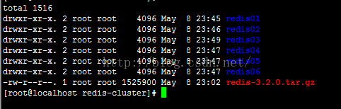
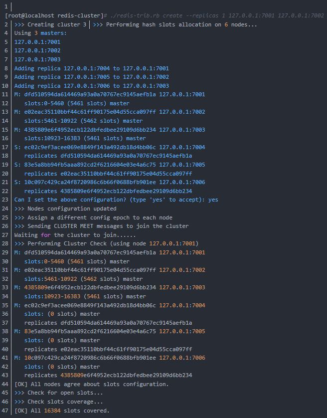

#Redis命令
##一、数据类型对应的命令
- String
```
set myKey "myValue"
get myKey
del myKey           # 删除
incr myKey          # 对数值类型的key加一
incrBy myKey 10     # 将key所储存的值加上给定的增量值（increment） 
decr myKey
decrBy myKey 10

```

- Hash：是一个 string 类型的 field 和 value 的映射表，每个 hash 可以存储 232 -1 键值对（40多亿）。
```
hmset myHash field1 "Hello" field "World"  #双引号可带可不带
hget myHash field1
hget myHash field2 
hGetAll myHash
```

- List：是字符串列表，按照插入顺序排序。列表最多可存储 232 - 1 元素 (4294967295, 每个列表可存储40多亿)。
```
lpush myList redis1
lpush myList redis2
lpush myList redis3

lrange myList 0 10
lpop myList             # 移出并获取列表的第一个元素
```

- Set：是string类型的无序集合，集合中最大的成员数为 232 - 1(4294967295, 每个集合可存储40多亿个成员)。
```
sadd mySet redis1
sadd mySet redis2
sadd mySet redis3

smembers mySet
srem mySet redis1       # 移除
```

- SortedSet：是string类型元素的有序集合，每个元素都会关联一个double类型的分数，通过分数进行从小到大的排序。
```
zadd mySortedSet 3 redis3
zadd mySortedSet 1 redis1
zadd mySortedSet 2 redis2

zRangeByScore mySortedSet 0 1000
zrem mySortedSet redis1
```

##二、发布订阅
```
subscribe redisChannel  # 创建了订阅频道名为 redisChat:

publish redisChannel "Redis is a great caching technique"  
                        # 然后在同一个频道redisChat发布消息，订阅者就能接收到消息。
```

##三、数据的保存和删除

- 保存数据到硬盘
```
bgsave      # 后台异步保存
save        # 同步保存
```

- 删除key
```
keys *      # 查找所有的key
keys t??    # 三个字符以t开头
keys *o*    # 中间含有o的字符，four，two，one

flushall    # 清除所有库所有key数据
flushdb     # 清除单个库所有key数据
```

- 同步master节点的数据到slave节点
```
sync
```

##四、密码安全
- 单机密码设置
```
masterauth                  # master节点密码，当slave要拉去master的时候需要这个密码
requirepass                 # redis服务器密码
```

- 集群密码设置
```
masterauth 1234             # 修改所有redis集群中的redis.conf文件 
requirepass 1234            # 修改所有redis集群中的redis.conf文件 

    # 注意所有节点的密码都必须一致
    # 然后，通过指令找到安装的redis在ruby环境中的配置client.rb，加上密码
```


##五、其它
- 批量命令，并非事务
```
multi           # 单个执行
set myKey1 aaa
set myKey2 bbb
exec            # 批量执行脚本，但批量指令并非原子化的操作，中间某条指令的失败不会导致前面已做指令的回滚，也不会造成后续的指令不做。
```

- 事务
```
watch myKey1 myKey2
multi
set myKey1 aaa
set myKey2 bbb
exec            # 如果执行命令的期间myKey1，myKey2任意一个改变，将全部回滚，一个都不执行；但是中间有语法错误或者运行错误不会回滚
unwatch
```

- 查看服务是否运行
```
ping
```

- 切换到指定的数据库，默认16个
```
select 1
```

- 获取redis服务器的信息
```
info
```

- 恢复数据，只需将备份文件(dump.rdb)移动到redis安装目录并启动服务即可
```
config get dir      # 获取redis目录可以使用CONFIG命令
```

- 安全相关
```
config get requirepass          # 查看是否设置了密码验证
config set requirepass admin    # 设置密码
auth admin                      # 用密码登录
```


#redis集群的搭建
集群中至少应该有奇数个节点，所以至少有三个节点，每个节点至少有一个备份节点，所以下面使用6节点（主节点、备份节点由redis-cluster集群确定）。

##Windows
windows下安装Redis客户端比较困难，一般仅仅安装单节点作为开发用

###一、单节点Redis启动
1. 下载redis for windows，并解压
2. windows: redis-server.exe redis.windows.conf
```
redis-server --maxclients 100000    # 服务启动时设置客户端最大连接数为1000
```

###二、Redis客户端连接
- windows: redis-cli.exe -h 127.0.0.1 -p 6379

```
config get maxclients   # 获客户端最大连接数

quit            # 关闭当前客户端连接
shutdown save   # 关闭redis服务器
```


##Linux

###一、单节点Redis安装，并配置指定端口
1. 安装的前提条件，需要安装gcc
```
yum install gcc-c++
```
2. 下载redis的源码包，把源码包上传到linux服务器，解压redis压缩包，编译安装
```
    tar -zxvf redis-3.2.0.tar.gz
    cd redis-3.2.0
    make                                    # 编译
    make install PREFIX=/usr/local/redis    # 安装位置
```

3. 在redis-cluster下 修改bin文件夹为redis01,复制redis.conf配置文件，配置redis的配置文件redis.conf
```
daemonize yes               #后台启动
port 7001                   #修改端口号，从7001到7006
cluster-enabled yes         #如果是yes，表示启用集群，否则以单例模式启动
cluster-config-file nodes.conf
cluster-node-timeout 15000  #超时时间，集群节点不可用的最大时间
```

```
dump.rdb为内存的快照文件，指定了appendonly则保存在其它文件的事用户输入的命令，这个效率低
突然宕机dump.rdb丢失的数据会多一点，而appendonly最多丢失一秒钟
```

4. 启动方式
```
前台启动模式：
    /usr/local/redis/bin/redis-server
    默认是前端启动模式，端口是6379
    
后台启动
1）从redis的源码目录中复制redis.conf到redis的安装目录。
2）修改配置文件：daemonize yes
3）./redis-server redis.conf
```

###二、集群Redis安装
1. 复制六份，修改对应的端口号，启动所有的redis节点

```
写一个命令脚本start-all.sh

cd redis01
./redis-server redis.conf
cd ..
cd redis02
./redis-server redis.conf
cd ..
cd redis03
./redis-server redis.conf
cd ..
cd redis04
./redis-server redis.conf
cd ..
cd redis05
./redis-server redis.conf
cd ..
cd redis06
./redis-server redis.conf
cd ..


[root@localhost redis-cluster]# chmod 777 start-all.sh 
[root@localhost redis-cluster]# ./start-all.sh 

查看redis进程启动状态
[root@localhost redis-cluster]# ps -ef | grep redis
 
root       4547      1  0 23:12 ?        00:00:00 ./redis-server 127.0.0.1:7001 [cluster]
root       4551      1  0 23:12 ?        00:00:00 ./redis-server 127.0.0.1:7002 [cluster]
root       4555      1  0 23:12 ?        00:00:00 ./redis-server 127.0.0.1:7003 [cluster]
root       4559      1  0 23:12 ?        00:00:00 ./redis-server 127.0.0.1:7004 [cluster]
root       4563      1  0 23:12 ?        00:00:00 ./redis-server 127.0.0.1:7005 [cluster]
root       4567      1  0 23:12 ?        00:00:00 ./redis-server 127.0.0.1:7006 [cluster]
root       4840   4421  0 23:26 pts/1    00:00:00 grep --color=auto redis

可以看到redis的6个节点已经启动成功，杀死全部的几点：
[root@localhost redis-cluster]# pkill -9 redis


```

2. 安装redis-trib所需的 ruby脚本
```
1.复制redis解压文件src下的redis-trib.rb文件到redis-cluster目录
    [root@localhost redis-cluster]# cp /usr/andy/redis/redis-3.2.0/src/redis-trib.rb ./
    
2.安装ruby环境：
    [root@localhost redis-cluster]# yum install ruby
    [root@localhost redis-cluster]# yum install rubygems    # 安装rubygems
    
3.安装redis-trib.rb运行依赖的ruby的包redis-3.2.2.gem，这个包需要上传到linux服务
    [root@localhost redis-cluster]# gem install redis-3.2.2.gem
```

3. 使用redis-trib.rb创建集群
- 使用create命令 --replicas 1 参数表示为每个主节点创建一个从节点，其他参数是实例的地址集合。

```
./redis-trib.rb create --replicas 1 127.0.0.1:7001 127.0.0.1:7002 127.0.0.1:7003 127.0.0.1:7004 127.0.0.1:7005 127.0.0.1:7006
```


```
有3个主节点，3个从节点，每个节点都是成功连接状态。

3个主节点[M]以及分配的哈希卡槽如下：

  M: dfd510594da614469a93a0a70767ec9145aefb1a 127.0.0.1:7001
       slots:0-5460 (5461 slots) master
  M: e02eac35110bbf44c61ff90175e04d55cca097ff 127.0.0.1:7002
       slots:5461-10922 (5462 slots) master
  M: 4385809e6f4952ecb122dbfedbee29109d6bb234 127.0.0.1:7003
       slots:10923-16383 (5461 slots) master

3个从节点[S]以及附属的主节点如下：

  S: ec02c9ef3acee069e8849f143a492db18d4bb06c 127.0.0.1:7004
       replicates dfd510594da614469a93a0a70767ec9145aefb1a
  S: 83e5a8bb94fb5aaa892cd2f6216604e03e4a6c75 127.0.0.1:7005
       replicates e02eac35110bbf44c61ff90175e04d55cca097ff
  S: 10c097c429ca24f8720986c6b66f0688bfb901ee 127.0.0.1:7006
       replicates 4385809e6f4952ecb122dbfedbee29109d6bb234

以上集群安装成功了，如果安装未成功报如下错误
   >>> Creating cluster
   [ERR] Sorry, can't connect to node  ....
   
需要安装最新的ruby源码
[root@localhost redis-cluster]# tar -zxvf ruby-2.3.1.tar.gz 
[root@localhost redis-cluster]# cd  
[root@localhost redis-cluster]# ./configure --prefix=/usr/local/ruby-2.3.1  
[root@localhost redis-cluster]# make && make install     
[root@localhost redis-cluster]#gem install redis
```

###三、Redis客户端
```
单机连接
./redis-cli -h localhost -p 7001 -a password
```

```
集群连接
./redis-cli -h localhost -c -p 7001 -a password
```

```
集群关闭
./redis-cli -p 7001 shutdown
```
