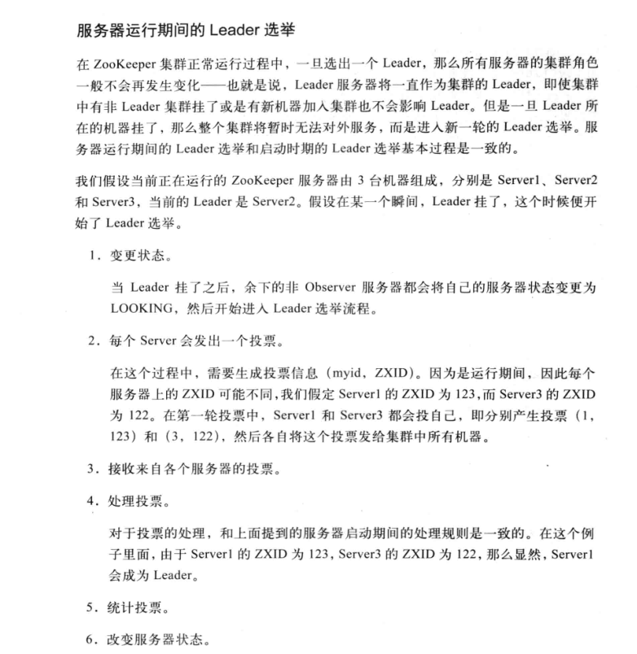
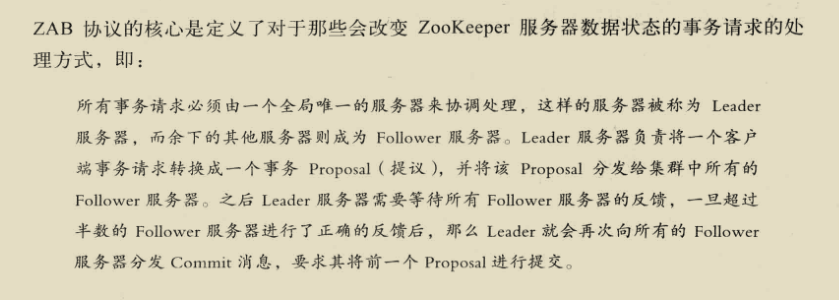

####分布式系统的定义：
分布式系统是一个硬件或软件组分布在不同的网络计算机上，彼此之间仅仅通过消息传递进行通信和协调的系统。    

####分布式系统的特点：  

1.分布性  
分布式系统中的多台计算机在空间上随意分布，不同城市，不同机房，不同机柜  
2.对等性  
没有主/从之分，没有控制整个系统的主机，也没有被控制的从机，分布式系统所有的计算机节点都是对等的  
3.并发性    
银行转账A转B问题  

####分布式系统的各种问题：
1.通信异常  
单机内存访问的延时在纳秒量级（通常10ns），而一次网络通信的延迟在0.1-1ms左右，相当于内存访问延时的100多倍  
2.网络分区  
网络由于发生异常，导致分布式系统中部分节点之间的网络延时不断增大，最终导致分布式系统中只有部分节点能保持正常通行，将这个现象称为网络分区。  
这时会出现小集群，在极端情况下，这些小集群需要完成整个分布式系统所要完成的工作。  
3.三态  
分布式系统中每一次的请求与相应，都存在三态，成功，失败，超时。 出现超时现象无法确定当前请求是否被成功处理  
4.节点故障  
每个节点都有可能会出现故障，并且每天都在发生  
5.缺乏全局时钟   
很难定义两个时间谁先谁后  

###事务（Transaction）
ACID  
1.原子性（Atomicity）[ˌætəˈmɪsɪti] 要么做要么不做  
2.一致性（Consistency）事务的执行不能破坏数据库的完整性和一致性  
3.隔离性（Isolation）[ˌaɪsəˈleʃən] 在标准的SQL规范中有4个事务隔离级别  
未授权读取，授权读取，可重复读取，串行化。

4.持久性（Durability）[djʊərə'bɪlətɪ] 事务一旦提交，它对数据库的状态变更就应该是永久性的。

###CAP定理（CAP theorem /ˈθɪərəm/）

C：一致性(Consistency)，所有节点在同一时间具有相同的数据  
A：可用性(Availability)，保证每个请求在一定时间内，不管成功或者失败都有响应  
P：分区容错性(Partition tolerance)，系统中任意信息的丢失或失败不会影响系统的继续运作，一般指增加删除节点导致网络分区，不同分区依然可用

CA：  
    CA要求在多个节点满足数据的严格一致性，且延迟较低。
    如果要满足P，则可以容忍数据丢包，因为数据在跨节点传输时有可能会丢包，如果丢包就无法满足一致性。
    所以CA一般单点集群，传统的数据库系统就是具有CA特征的数据库，所以在可扩展性上不强，水平扩展能力比较差。

CP：  
    满足一致性，分区容忍性的系统，因为P会导致系统的节点无线延长，也就无法在一定时间内保证可用性。
    通常性能不是特别高。

AP：   
    满足可用性，分区容忍性的系统，就要放弃强一致性，保证最终一致性。因为为了保证可用性，有时候节点就会用自己的本地数据，导致数据不一致性。  
    
因为是分布式系统，所以应用必然需要部署到不同的节点中，因此必然出现子网络，所以P是分布式系统首先需要满足的。  
系统架构师往往把精力花在如何根据业务特点在C和A之间寻求平衡。  

###BASE理论
Basically Available（基本可用），运行损失部分可用性，如响应时间加长，或者功能上的损失，如双11服务降级   
Soft state（软状态），允许在不同节点的数据副本之间进行数据同步的过程中存在延时   
Eventually consistency（最终一致性），系统中的副本，在经过一段时间的同步后，最终能够达到一个一致的状态   
三个短语的简写即为BASE，BASE是对CAP中一致性和可用性权衡的结果，核心思想是即使无法做到强一致性（Strong consistency），但每个业务可以根据自身的业务特点，采用适当的方式来使系统达到最终一致性。

###分布式一致性协议  
当一个事务需要跨多个分布式节点的时候，为了保持事务处理的ACID特性，就需要引入一个称为“协调者”的组件来统一调度所有分布式节点的执行逻辑，来保证一致性。   

2PC：Two Phase Commit，二段提交协议，大多数关系型数据库都是采用的这个协议来完成分布式事务的   

3PC：Three Phase Commit，三阶段提交协议  

####Paxos：分布式一致性算法  
Proposer（提议者），Acceptor（决策者），Client（产生议题者），Learner（最终决策学习者）  
现在通过一则故事来学习paxos的算法的流程(2阶段提交)，有2个Client(老板，老板之间是竞争关系)和3个Acceptor(政府官员)：  
现在需要对一项议题来进行paxos过程，议题是“A项目我要中标！”，这里的“我”指每个带着他的秘书Proposer的Client老板。  
Proposer当然听老板的话了，赶紧带着议题和现金去找Acceptor政府官员。作为政府官员，当然想谁给的钱多就把项目给谁。  
Proposer-1小姐带着现金同时找到了Acceptor-1~Acceptor-3官员，1与2号官员分别收取了10比特币，找到第3号官员时，没想到遭到了3号官员的鄙视，3号官员告诉她，Proposer-2给了11比特币。  
不过没关系，Proposer-1已经得到了1,2两个官员的认可，形成了多数派(如果没有形成多数派，Proposer-1会去银行提款在来找官员们给每人20比特币，这个过程一直重复每次+10比特币，直到多数派的形成)，  
满意的找老板复命去了，但是此时Proposer-2保镖找到了1,2号官员，分别给了他们11比特币，1,2号官员的态度立刻转变，都说Proposer-2的老板懂事，这下子Proposer-2放心了，搞定了3个官员，  
找老板复命去了，当然这个过程是第一阶段提交，只是官员们初步接受贿赂而已。故事中的比特币是编号，议题是value。  
这个过程保证了在某一时刻，某一个proposer的议题会形成一个多数派进行初步支持。  
===============华丽的分割线，第一阶段结束================
现在进入第二阶段提交，现在proposer-1小姐使用分身术(多线程并发)分了3个自己分别去找3位官员，最先找到了1号官员签合同，遭到了1号官员的鄙视，  
1号官员告诉他proposer-2先生给了他11比特币，因为上一条规则的性质proposer-1小姐知道proposer-2第一阶段在她之后又形成了多数派(至少有2位官员的赃款被更新了);  
此时她赶紧去提款准备重新贿赂这3个官员(重新进入第一阶段)，每人20比特币。刚给1号官员20比特币， 1号官员很高兴初步接受了议题，还没来得及见到2,3号官员的时候，  
这时proposer-2先生也使用分身术分别找3位官员(注意这里是proposer-2的第二阶段)，被第1号官员拒绝了告诉他收到了20比特币，  
第2,3号官员顺利签了合同，这时2，3号官员记录client-2老板用了11比特币中标，因为形成了多数派，所以最终接受了Client2老板中标这个议题，对于proposer-2先生已经出色的完成了工作；  

这时proposer-1小姐找到了2号官员，官员告诉她合同已经签了，将合同给她看，proposer-1小姐是一个没有什么职业操守的聪明人，觉得跟Client1老板混没什么前途，  
所以将自己的议题修改为“Client2老板中标”，并且给了2号官员20比特币，这样形成了一个多数派。顺利的再次进入第二阶段。由于此时没有人竞争了，顺利的找3位官员签合同，  
3位官员看到议题与上次一次的合同是一致的，所以最终接受了，形成了多数派，proposer-1小姐跳槽到Client2老板的公司去了。  

####ZAB：原子消息广播协议算法
ZAB：Zookeeper Atomic Broadcast，原子消息广播协议，Zookeeper分布式一致性的核心算法。包括两部分：崩溃恢复和消息广播（类似二阶段的提交过程）。  
具体一点可以分为三个阶段：发现（Leader选举），同步（Leader和Follower之间的同步），广播（接受客户端新的事务请求）。  
每个节点都可能处在三种状态，looking：leader选举阶段，following：follower服务器和leader保持同步状态，leading：Leader服务器作为主进程领导状态。  

Paxos和ZAB的本质区别在于两者的设计目标不太一样。前者用于构建一个分布式的一致性状态机系统，而后者用于构建一个高可用的分布式数据主备系统。  

####Zookeeper的三种选举算法：LeaderElection，AuthFastLeaderElection，FastLeaderElection    
默认的算法是FastLeaderElection：  
启动时的选举算法如下：
目前有5台服务器，每台服务器均没有数据，它们的编号分别是1,2,3,4,5,按编号依次启动，它们的选择举过程如下：  
服务器1启动，给自己投票，然后发投票信息，由于其它机器还没有启动所以它收不到反馈信息，服务器1的状态一直属于Looking。  
服务器2启动，给自己投票，同时与之前启动的服务器1交换结果，由于服务器2的编号大所以服务器2胜出，但此时投票数没有大于半数，所以两个服务器的状态依然是LOOKING。  
服务器3启动，给自己投票，同时与之前启动的服务器1,2交换信息，由于服务器3的编号最大所以服务器3胜出，此时投票数正好大于半数，所以服务器3成为领导者，服务器1,2成为小弟。  
服务器4启动，给自己投票，同时与之前启动的服务器1,2,3交换信息，尽管服务器4的编号大，但之前服务器3已经胜出，所以服务器4只能成为小弟。  
服务器5启动，后面的逻辑同服务器4成为小弟。  

崩溃恢复时的选举算法：

###Zookeeper可以保证的分布式一致性特性：  
分布式应用可以基于Zookeeper实现如数据发布/订阅，负载均衡，命名服务，分布式协调/通知,集群管理，Master选举，分布式锁，分布式队列   
   
高性能：Zookeeper将全量数据存储在内存中，并直接服务于客户端的所有非事务请求，因此它尤其适用于以读操作为主的应用场景。Zookeeper性能压测在100%读请求的场景下可以达到12-13W的QPS。  
顺序访问：对于每一个客户端的请求，Zookeeper都会生成一个全局唯一的递增序号，这个序号反映了所有事务操作的先后顺序，应用程序可以使用这个特性来实现更高层次的同步原语。  
Leader服务器在产生一个新的事务的时候，会生成一个序列号ZXID，Zookeeper Transaction ID，这个ID有64位，前32位代表事务编号，每个事务加1，后32位代表发给客户端的计数器，每发给客户端计数器加1

    

