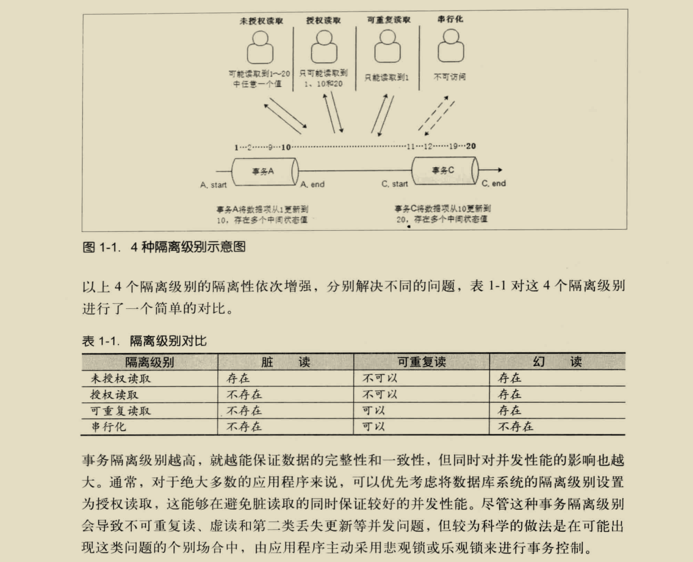
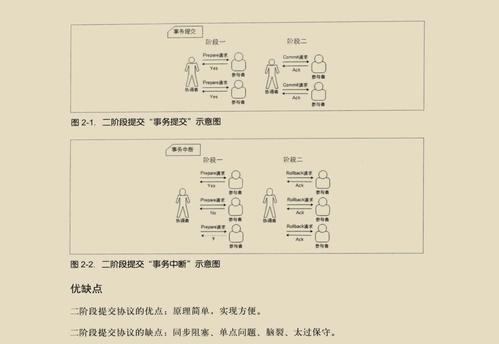
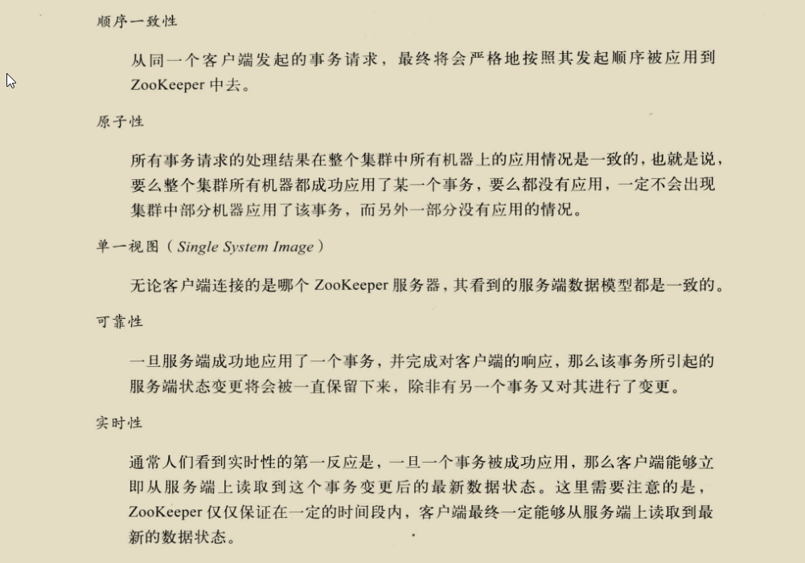

####分布式系统的定义：
分布式系统是一个硬件或软件组分布在不同的网络计算机上，彼此之间仅仅通过消息传递进行通信和协调的系统。    

####分布式系统的特点：  

1.分布性  
分布式系统中的多台计算机在空间上随意分布，不同城市，不同机房，不同机柜  
2.对等性  
没有主/从之分，没有控制整个系统的主机，也没有被控制的从机，分布式系统所有的计算机节点都是对等的  
3.并发性    
银行转账A转B问题  
4.缺乏全局时钟   
很难定义两个时间谁先谁后  

####分布式系统的各种问题：
1.通信异常  
单机内存访问的延时在纳秒量级（通常10ns），而一次网络通信的延迟在0.1-1ms左右，相当于内存访问延时的100多倍  
2.网络分区  
网络由于发生异常，导致分布式系统中部分节点之间的网络延时不断增大，最终导致分布式系统中只有部分节点能保持正常通行，将这个现象称为网络分区。  
这时会出现小集群，在极端情况下，这些小集群需要完成整个分布式系统所要完成的工作。  
3.三态  
分布式系统中每一次的请求与相应，都存在三态，成功，失败，超时。 出现超时现象无法确定当前请求是否被成功处理  
4.节点故障  
每个节点都有可能会出现故障，并且每天都在发生  

###事务（Transaction）
ACID  
1.原子性（Atomicity）[ˌætəˈmɪsɪti] 要么做要么不做  
2.一致性（Consistency）事务的执行不能破坏数据库的完整性和一致性  
3.隔离性（Isolation）[ˌaɪsəˈleʃən] 在标准的SQL规范中有4个事务隔离级别  
未授权读取，授权读取，可重复读取，串行化。

4.持久性（Durability）[djʊərə'bɪlətɪ] 事务一旦提交，它对数据库的状态变更就应该是永久性的。

###CAP定理（CAP theorem /ˈθɪərəm/）

C：一致性(Consistency)，所有节点在同一时间具有相同的数据  
A：可用性(Availability)，保证每个请求在一定时间内，不管成功或者失败都有响应  
P：分区容错性(Partition tolerance)，系统中任意信息的丢失或失败不会影响系统的继续运作，一般指增加删除节点导致网络分区，不同分区依然可用

CA：  
    CA要求在多个节点满足数据的严格一致性，且延迟较低。
    如果要满足P，则可以容忍数据丢包，因为数据在跨节点传输时有可能会丢包，如果丢包就无法满足一致性。
    所以CA一般单点集群，传统的数据库系统就是具有CA特征的数据库，所以在可扩展性上不强，水平扩展能力比较差。

CP：  
    满足一致性，分区容忍性的系统，因为P会导致系统的节点无线延长，也就无法在一定时间内保证可用性。
    通常性能不是特别高。

AP：   
    满足可用性，分区容忍性的系统，就要放弃强一致性，保证最终一致性。因为为了保证可用性，有时候节点就会用自己的本地数据，导致数据不一致性。  
    
因为是分布式系统，所以应用必然需要部署到不同的节点中，因此必然出现子网络，所以P是分布式系统首先需要满足的。  
系统架构师往往把精力花在如何根据业务特点在C和A之间寻求平衡。  

###BASE理论
Basically Available（基本可用），运行损失部分可用性，如响应时间加长，或者功能上的损失，如双11服务降级   
Soft state（软状态），允许在不同节点的数据副本之间进行数据同步的过程中存在延时   
Eventually consistency（最终一致性），系统中的副本，在经过一段时间的同步后，最终能够达到一个一致的状态   
三个短语的简写即为BASE，BASE是对CAP中一致性和可用性权衡的结果，核心思想是即使无法做到强一致性（Strong consistency），但每个业务可以根据自身的业务特点，采用适当的方式来使系统达到最终一致性。

###分布式一致性协议  
当一个事务需要跨多个分布式节点的时候，为了保持事务处理的ACID特性，就需要引入一个称为“协调者”的组件来统一调度所有分布式节点的执行逻辑，来保证一致性。   

2PC：Two Phase Commit，二段提交协议，大多数关系型数据库都是采用的这个协议来完成分布式事务的   

3PC：Three Phase Commit，三阶段提交协议  

Paxos：分布式一致性算法  

ZAB：Zookeeper Atomic Broadcast，原子消息广播协议，Zookeeper分布式一致性的核心算法。包括两部分：崩溃恢复和消息广播（类似二阶段的提交过程）。  
具体一点可以分为三个阶段：发现（Leader选举），同步（Leader和Follower之间的同步），广播（接受客户端新的事务请求）。  
每个节点都可能处在三种状态，looking：leader选举阶段，following：follower服务器和leader保持同步状态，leading：Leader服务器作为主进程领导状态。  

Paxos和ZAB的本质区别在于两者的设计目标不太一样。前者用于构建一个分布式的一致性状态机系统，而后者用于构建一个高可用的分布式数据主备系统。  

###Zookeeper可以保证的分布式一致性特性：  
分布式应用可以基于Zookeeper实现如数据发布/订阅，负载均衡，命名服务，分布式协调/通知,集群管理，Master选举，分布式锁，分布式队列   
   
高性能：Zookeeper将全量数据存储在内存中，并直接服务于客户端的所有非事务请求，因此它尤其适用于以读操作为主的应用场景。Zookeeper性能压测在100%读请求的场景下可以达到12-13W的QPS。  
顺序访问：对于每一个客户端的请求，Zookeeper都会生成一个全局唯一的递增序号，这个序号反映了所有事务操作的先后顺序，应用程序可以使用这个特性来实现更高层次的同步原语。  
Leader服务器在产生一个新的事务的时候，会生成一个序列号ZXID，Zookeeper Transaction ID，这个ID有64位，前32位代表事务编号，每个事务加1，后32位代表发给客户端的计数器，每发给客户端计数器加1

    

